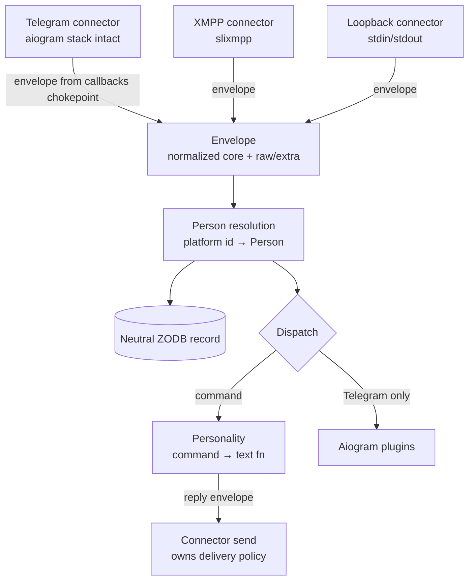

# Connector ABC: Platform-Abstraction Foundation for ia.cecil

## Summary

Introduce a minimal connector interface (connect / listen / send) that demotes Telegram from chassis to connector #1, shipping three connectors — loopback (REPL test harness), Telegram (wrapping the existing aiogram stack intact), and XMPP via slixmpp — plus the platform-neutral data model they share: a message envelope, a neutral ZODB record, and a canonical person identity. Personalities become platform-blind command→text maps and provide day-1 behavior on every connector.

---

## Problem Frame

ia.cecil was meant to be platform-agnostic but only works as a Telegram bot. The coupling is total: all ~30 plugins import aiogram directly, `IACecilBot` subclasses aiogram's `Bot` with Telegram-specific delivery policy and exceptions (being kicked from the logger group calls `sys.exit`), personalities receive `aiogram.types.Message`, and `callbacks.py` persists live aiogram objects into ZODB — making the database itself aiogram-shaped. The one prior attempt at a second platform (Furhat) became a parallel controller tree duplicating personality logic rather than sharing an abstraction. Adding any platform today means forking the framework; this work makes platform N+1 a bounded connector module instead.

There is no external deployment waiting for XMPP or Discord; the driver is the R&D goal itself (STRATEGY.md: composability via runtime-loadable modules) and Telegram lock-in risk. Success criteria are therefore framework-internal.

---

## Key Decisions

- **Minimal three-method connector interface** (connect / listen / send + lifecycle), opsdroid-style, over a richer Errbot-style backend class. Smaller surface per new platform; each connector owns its own delivery policy (retries, length splitting, platform error taxonomy).
- **Engulf, don't rebuild**: the Telegram connector wraps the existing aiogram dispatcher, `IACecilBot`, and webhook plumbing intact (strangler-fig). Envelopes are emitted from the existing `callbacks.py` chokepoint where all message traffic already converges. Telegram behavior is unchanged throughout.
- **Full data model decided now** — envelope, neutral persisted record, canonical identity — because every day of delay grows the aiogram-pickle lock-in in ZODB and every plugin storing per-user state hardcodes Telegram IDs.
- **Simplest mechanisms on purpose**: connectors load by config name via `import_module` from an in-tree package (mirroring plugin loading); a connector activates for a bot iff its config section has credentials. No new config schema, no entry points yet.
- **Personalities are the day-1 cross-platform behavior layer**; plugins follow per-connector, progressively. Without this, a new connector would connect and then do nothing.
- **Loopback is the definition of done**: a full conversation with zero network proves the abstraction is real and doubles as the project's first test harness.

---

## Requirements

**Connector interface**

- R1. A connector implements connect, listen (deliver inbound events as envelopes), send (accept outbound envelopes), and disconnect; each connector owns its platform's delivery policy — retry, message-length splitting, and error handling live inside the connector, not in shared core code.
- R2. A connector failure (crash, kick, network loss) must not terminate the process; the failed connector is marked down and logged while other connectors keep serving. This replaces the current `BotKicked → sys.exit` behavior.

**Loading and activation**

- R3. Connectors are discovered by name via dynamic import from an in-tree connectors package, mirroring the existing plugin-loading pattern.
- R4. A connector activates for a bot iff that bot's config has the matching section with credentials (e.g. `telegram` dict with a token, `xmpp` section with JID/password). Existing bot configs keep working without changes.

**Connectors shipped**

- R5. Loopback connector: stdin/stdout REPL, no network. The acceptance milestone for the whole effort: the bot boots, loads personalities, and holds a full conversation through loopback alone.
- R6. Telegram connector: wraps the existing aiogram dispatcher and `IACecilBot` intact; emits envelopes from the existing `callbacks.py` chokepoint; all current Telegram behavior (plugins included) is preserved unchanged.
- R7. XMPP connector via slixmpp: send and receive text in direct chats; group-chat (MUC) support level is decided during planning.

**Envelope and persistence**

- R8. A platform-neutral envelope carries a normalized core (platform, sender ref, conversation ref, text, reply ref, tags) plus `raw` (the native platform object) and `extra` (a dict the core never inspects) as the escape hatch.
- R9. Message persistence stores the envelope's normalized fields as a neutral ZODB record; live platform objects are never pickled into the database again.
- R10. Existing ZODB history (pickled aiogram objects) is left as read-only legacy; no migration.

**Identity**

- R11. A canonical Person record in ZODB maps `(platform, native_id)` pairs to one person; per-user state, allowlists, and permissions key on Person, not on platform IDs.
- R12. An unrecognized platform ID auto-creates a Person with that single mapping. Cross-platform linking (one human claiming two platform IDs) is out of scope for this round; the data model must allow merging later.

**Personalities**

- R13. The personality contract becomes a declarative command→async-text-function map operating on envelopes; the core auto-registers those commands per connector. Personalities hold no dispatcher or aiogram references.
- R14. The same configured personality answers its commands on every active connector with no per-platform personality code.

**Plugins**

- R15. Aiogram-dependent plugins bind only under the Telegram connector: the loader registers `add_handlers` when Telegram/aiogram is active; for any other connector it loads a no-op and logs a warning naming the plugin and connector.
- R16. The plugin contract gains per-connector handler entry points so each plugin can be refactored connector-by-connector using that connector's specifics; Telegram behavior stays unchanged while this happens.

---

## Inbound Message Flow

---

## Acceptance Examples

- AE1. **Covers R4, R14, R15.** Given a bot config with both `telegram` and `xmpp` credentials, when the bot starts, then both connectors connect; aiogram plugins serve Telegram; each aiogram plugin logs one warning for XMPP; the personality's commands answer on both platforms.
- AE2. **Covers R5, R9, R13.** Given the loopback connector and a configured personality, when `/start` is typed on stdin, then the personality's start text prints to stdout and a neutral record (not a pickled platform object) is persisted.
- AE3. **Covers R2.** Given Telegram and XMPP both active, when the XMPP server becomes unreachable, then the XMPP connector is marked down with a logged error and Telegram service continues; the process stays alive.
- AE4. **Covers R11, R12.** Given a person messaging from a previously unseen XMPP JID, when the envelope is processed, then a new Person is created with the single (xmpp, jid) mapping — independent of any Person holding their Telegram ID.

---

## Success Criteria

- The loopback conversation passes end-to-end with zero network — the agnosticism falsifier.
- One personality, zero per-platform personality code, answering on loopback + Telegram + XMPP.
- No aiogram imports outside the Telegram connector and the legacy plugins it hosts.
- The process survives any single connector failure.
- A new connector requires only: one module in the connectors package + one config section (feeds STRATEGY.md's time-to-new-plugin / feature-compounding metrics).

---

## Scope Boundaries

Deferred for later:

- Discord connector (XMPP validates the second-platform path first).
- Aiogram compat shim and any plugin rewrite or codemod.
- Furhat port onto the connector interface (the personality decoupling lays its groundwork).
- Entry-points packaging for third-party connectors.
- Capability tiers and degradation ladders (loopback and XMPP are text-first; revisit when a media-rich second platform lands).
- Cross-platform identity claim/link flow (R12 keeps the door open).
- Migration of legacy ZODB data.

---

## Dependencies / Assumptions

- aiogram stays pinned at 2.25.1 inside the Telegram connector; its EOL is contained, not solved, by this work.
- slixmpp currently requires Python 3.11+ while the project pins 3.10 — verify during planning; either upgrade Python or pin a compatible slixmpp release. Unverified assumption until checked.
- Operator/debug logging today routes through Telegram (`src/iacecil/controllers/log.py`); connector-failure logging (R2) must use the terminal logger so a non-Telegram failure is still observable.
- No external deployment is waiting; pace and sequencing are governed by the loopback proof milestone, not a launch date.

---

## Outstanding Questions

Resolve before planning: none.

Deferred to planning:

- XMPP minimum feature set (direct chats only vs MUC rooms).
- slixmpp / Python-version compatibility resolution (see Dependencies).
- Where envelope dispatch lives (a small bus vs a registry on the existing dispatcher attachment pattern).
- Exact shape of the per-connector plugin entry points (naming convention vs registry).

---

## Sources / Research

- docs/ideation/2026-06-10-platform-agnostic-ideation.html — ranked ideas this brainstorm draws from (ideas 2, 3, 4, 5, 6).
- src/iacecil/controllers/aiogram_bot/bot.py — Telegram delivery policy and `sys.exit` failure mode to relocate (R1, R2).
- src/iacecil/controllers/aiogram_bot/callbacks.py — the chokepoint where envelopes are emitted (R6) and where pickled-aiogram persistence happens today (R9).
- src/iacecil/config.py — parallel platform dicts that R4's credentials-presence rule activates.
- STRATEGY.md — composability approach and metrics the success criteria tie into.
- Prior art: opsdroid Connector ABC (interface shape), Matterbridge transparent envelope (R8), Errbot backends, Hubot's unsolved cross-platform identity (R11).
