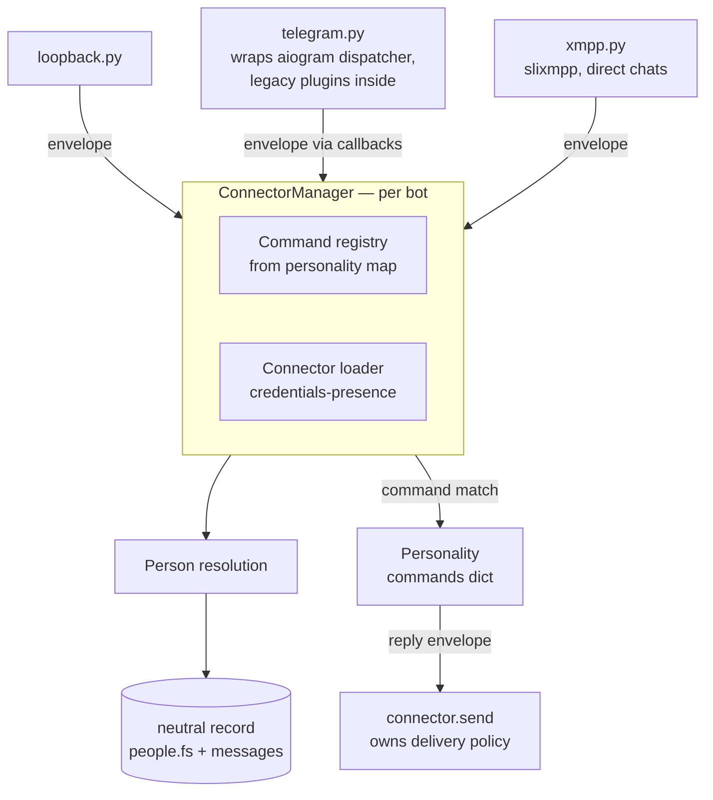

# feat: Connector ABC — Platform-Abstraction Foundation

## Summary

Build the platform-connector layer scoped in the origin brainstorm: a minimal connect/listen/send connector interface with loopback, Telegram (engulfing the existing aiogram stack), and XMPP (direct chats) connectors; a platform-neutral envelope, neutral ZODB record, and canonical Person identity; platform-blind personalities; and per-connector plugin loading with graceful no-op degradation. Prerequisite: bump the project to Python 3.11.

## Problem Frame

Every layer of ia.cecil hard-depends on aiogram: plugins, personalities, delivery policy, error handling, and even the ZODB database (live aiogram objects are pickled into it). Adding a platform today means forking the framework — the Furhat fork proves it. The origin doc (R1–R16) defines the abstraction that makes platform N+1 a bounded module; this plan sequences how to build it without breaking the running Telegram path. (see origin: docs/brainstorms/2026-06-10-connector-abc-requirements.md)

---

## Requirements

Carried from origin verbatim (R1–R16). Trace to units:

| Origin requirement | Unit(s) |
|---|---|
| R1 connector interface, connector-owned delivery policy | U3, U7, U8 |
| R2 connector failure never kills process | U3, U7 |
| R3 in-tree discovery by name | U3 |
| R4 credentials-presence activation | U3 |
| R5 loopback connector, proof milestone | U4 |
| R6 Telegram engulf, behavior unchanged | U7 |
| R7 XMPP direct chats | U8 |
| R8 envelope (normalized core + raw/extra) | U2 |
| R9 neutral persisted record | U2 |
| R10 legacy ZODB data untouched | U2 |
| R11 Person registry | U2 |
| R12 auto-create Person, merge-friendly | U2 |
| R13 declarative personality contract | U5 |
| R14 same personality on every connector | U5 |
| R15 aiogram plugins bind only under Telegram, warn elsewhere | U6 |
| R16 per-connector plugin entry points | U6 |

Origin acceptance examples AE1–AE4 are enforced in unit test scenarios (marked `Covers AE<N>`).

---

## Key Technical Decisions

- **Python 3.11 bump (not 3.13)**: slixmpp requires ≥3.11; aiogram 2.25.1 officially supports up to 3.11 — bumping exactly to 3.11 unblocks slixmpp while staying inside aiogram 2.x's supported range. `Pipfile` `python_version = "3.11"`, re-lock.
- **ConnectorManager with a command registry, not an event bus**: mirrors the existing attach-to-dispatcher pattern (`src/iacecil/controllers/aiogram_bot/__init__.py:55-88` setattr style). Inbound envelopes resolve to registered command handlers; non-command traffic goes to a default handler. Revisable to a bus later without touching connectors.
- **Per-connector plugin entry naming convention**: `add_handlers` (legacy name) ≡ Telegram/aiogram; `add_handlers_<connector>` for others (e.g. `add_handlers_xmpp`). Missing function → no-op + one warning naming plugin and connector. No registry object — a convention the existing loader can resolve with `getattr`.
- **Restore `testing.py` as the connector-aware dev runner**: `python -m iacecil` currently crashes (module missing). The restored module runs the ConnectorManager with loopback always active — fixing the broken default entry and giving the proof milestone a front door.
- **Envelope is a frozen dataclass; ZODB stores only its normalized fields**: `raw` and `extra` never persisted. Stops the aiogram-pickle lock-in (`src/iacecil/controllers/aiogram_bot/callbacks.py:37-52` today) without migrating old data (R10).
- **Person keyed by UUID with a mappings set**: `(platform, native_id)` pairs reference one Person; merge-friendly per R12. Stored under a new `instance/zodb/people.fs`, separate from the per-bot path scheme (which keys on Telegram bot id).
- **Telegram engulf at the callbacks chokepoint**: `message_callback`/`command_callback` (`src/iacecil/controllers/aiogram_bot/callbacks.py`) emit envelopes in addition to current behavior; outbound stays on `IACecilBot`. `BotKicked → sys.exit` (`src/iacecil/controllers/aiogram_bot/bot.py:79-88`) becomes mark-down-and-log (R2).
- **Quart stays the host process**: ConnectorManager starts its connector tasks from the existing `@before_serving` hook (`src/iacecil/views/quart_app/__init__.py:114-146`), beside today's `start_polling` task creation.

---

## High-Level Technical Design



Startup sequence: production/testing runner builds bot configs → ConnectorManager per bot inspects config sections → instantiates matching connectors → Quart `@before_serving` creates one task per connector `listen()` → failures mark the connector down without stopping siblings.

Directional guidance, not implementation specification: exact module/class names may shift during implementation.

---

## Output Structure

```text
src/iacecil/
  connectors/
    __init__.py        # loader + ConnectorManager
    base.py            # Connector ABC + envelope dispatch helpers
    loopback.py
    telegram.py
    xmpp.py
  models/
    envelope.py        # Envelope dataclass, refs
  controllers/
    persistence/
      neutral.py       # Person registry + neutral message records
    _iacecil/
      testing.py       # restored dev runner (loopback default)
tests/
  conftest.py
  test_envelope.py
  test_person.py
  test_manager.py
  test_loopback.py
  test_personalities.py
  test_plugin_loading.py
  test_telegram_envelope.py
  test_xmpp.py
```

Scope declaration, not constraint — implementer may adjust layout.

---

## Implementation Units

### U1. Python 3.11 bump and test scaffolding

- **Goal:** unblock slixmpp; give the repo its first test infrastructure.
- **Requirements:** prerequisite for R7; enables loopback-as-harness (R5).
- **Dependencies:** none.
- **Files:** `Pipfile`, `Pipfile.lock`, `setup.cfg`, `pyproject.toml`, `tests/conftest.py`, `CLAUDE.md` (commands section).
- **Approach:** set `python_version = "3.11"`; add `pytest` + `pytest-asyncio` to dev-packages; add `slixmpp` to packages; re-lock; smoke-run the bot. Update CLAUDE.md "Requires Python 3.10" line and test-suite note.
- **Test scenarios:** Test expectation: none — dependency/config change. Verification is the smoke run plus `pipenv run pytest` collecting zero tests successfully.
- **Verification:** `pipenv install` succeeds on 3.11; `pipenv run prod` boots an existing bot config unchanged.

### U2. Envelope, Person registry, neutral persistence

- **Goal:** the platform-neutral data model (R8, R9, R10, R11, R12).
- **Requirements:** R8, R9, R10, R11, R12; AE4.
- **Dependencies:** U1.
- **Files:** `src/iacecil/models/envelope.py`, `src/iacecil/controllers/persistence/neutral.py`, `tests/test_envelope.py`, `tests/test_person.py`.
- **Approach:** frozen Envelope dataclass (platform, sender ref, conversation ref, text, reply ref, tags, raw, extra). Person: UUID + set of (platform, native_id) mappings; lookup-or-create. Neutral message record persists only normalized envelope fields; follow the existing FileStorage+ZlibStorage open pattern (`src/iacecil/controllers/persistence/zodb_orm.py:62-75`) but in a new module — leave `zodb_orm.py` and its data untouched (R10).
- **Execution note:** implement test-first; this is the schema everything marries.
- **Patterns to follow:** `persistence/zodb_orm.py` get_db/croak_db lifecycle; BTrees usage at `zodb_orm.py:483-537`.
- **Test scenarios:** envelope rejects mutation (frozen); record round-trip stores normalized fields and no `raw`/`extra` object; Covers AE4: unseen (xmpp, jid) creates new Person independent of an existing telegram Person; same (platform, id) twice resolves to one Person; merge of two Persons unions mappings (schema-level test, no UX).
- **Verification:** pytest green; existing legacy `.fs` files untouched by new code paths.

### U3. Connector ABC and ConnectorManager

- **Goal:** the boundary (R1) with loading (R3, R4) and failure isolation (R2).
- **Requirements:** R1, R2, R3, R4.
- **Dependencies:** U2.
- **Files:** `src/iacecil/connectors/base.py`, `src/iacecil/connectors/__init__.py`, `tests/test_manager.py`.
- **Approach:** ABC with `connect/listen/send/disconnect`; manager loads connectors via dynamic import from `iacecil.connectors` for each bot-config section with credentials (mirror plugin loader at `src/iacecil/controllers/aiogram_bot/__init__.py:100-114`); command registry maps command → handler; per-connector task wrapper catches exceptions, marks connector down, logs to terminal logger (not Telegram — `log.py` Telegram routing must not be the only sink), keeps siblings running.
- **Patterns to follow:** plugin loader mechanics; dispatcher attachment style for manager state.
- **Test scenarios:** config with telegram+xmpp creds loads two connectors, empty discord dict loads none (Covers AE1 setup); unknown section name logs error, skips; a connector whose `listen` raises is marked down while a second connector keeps dispatching (Covers AE3 at unit level); command registry routes `/start` envelope to registered handler; non-command envelope routes to default handler.
- **Verification:** pytest green; manager usable standalone in a REPL with a fake connector.

### U4. Loopback connector and restored dev runner — proof milestone

- **Goal:** stdin/stdout connector + working `python -m iacecil` (R5).
- **Requirements:** R5; AE2.
- **Dependencies:** U3, U5 (personality answers).
- **Files:** `src/iacecil/connectors/loopback.py`, `src/iacecil/controllers/_iacecil/testing.py`, `tests/test_loopback.py`.
- **Approach:** loopback reads lines from stdin, wraps as envelopes, prints replies to stdout; expose a programmatic `inject(text) -> reply` path so tests don't need a TTY. Restored `testing.py` provides `run_app(*args)` matching the import at `src/iacecil/__main__.py:48`: builds configs (DefaultBotConfig fallback), starts ConnectorManager with loopback forced on, no Quart needed for the minimal path.
- **Test scenarios:** Covers AE2: injecting `/start` returns personality start text and persists a neutral record; unknown command routes to default handler reply; plain text (non-command) gets default response; `python -m iacecil` boots without instance/ configs present (DefaultBotConfig path).
- **Verification:** run `python -m iacecil`, type `/start`, get an answer, Ctrl-C exits cleanly. This is the origin's definition of done.

### U5. Platform-blind personalities

- **Goal:** declarative command→text-fn contract; same persona everywhere (R13, R14).
- **Requirements:** R13, R14; AE1 (personality side).
- **Dependencies:** U2 (envelope), U3 (registry).
- **Files:** `src/iacecil/controllers/personalidades/__init__.py`, all 11 personality modules under `src/iacecil/controllers/personalidades/`, `tests/test_personalities.py`.
- **Approach:** each personality module gains a `commands: dict[str, async fn(envelope) -> str]` map (start, help, etc. — current functions at `src/iacecil/controllers/personalidades/default.py:48-103` already take a message and return str; adapt signatures to accept the envelope, which exposes the fields they read). Manager auto-registers the configured personality's commands per connector. Keep the existing aiogram `add_handlers`/`gerar_texto` path working during transition (Telegram legacy plugins call `gerar_texto` — `src/plugins/welcome.py:58`); it can delegate to the same command functions.
- **Execution note:** characterization snapshot of each personality's current /start and /help output before refactor; texts must not change.
- **Test scenarios:** default personality `start` over envelope returns text containing sender name; same personality object serves two fake connectors with identical output (R14); configured-but-missing command falls back to default personality (mirrors existing fallback at `personalidades/__init__.py:134-149`); Telegram legacy path (`gerar_texto`) still returns same text as the new path.
- **Verification:** pytest green; all 11 personalities import and expose `commands`.

### U6. Per-connector plugin loading contract

- **Goal:** graceful degradation for aiogram plugins (R15, R16).
- **Requirements:** R15, R16; AE1 (warning side).
- **Dependencies:** U3.
- **Files:** `src/iacecil/connectors/__init__.py` (loader extension), `src/iacecil/controllers/aiogram_bot/__init__.py` (delegate), `tests/test_plugin_loading.py`.
- **Approach:** loader resolves `add_handlers_<connector>` via getattr; for the telegram connector the legacy name `add_handlers` is the resolved entry; missing → bind no-op, log one `logger.warning` naming plugin + connector. Existing `add_plugin` (`src/iacecil/controllers/aiogram_bot/__init__.py:100-114`) delegates to the new resolver so order semantics (enable-list order) are preserved.
- **Patterns to follow:** existing add_plugin error-isolation (warn and continue).
- **Test scenarios:** Covers AE1: plugin with only `add_handlers` binds under telegram, logs exactly one warning under xmpp, no-ops; plugin with `add_handlers_xmpp` binds under xmpp; plugin with neither logs warnings for both; enable/disable list semantics unchanged for telegram.
- **Verification:** pytest green; warning text includes plugin name and connector name.

### U7. Telegram connector — engulf the aiogram stack

- **Goal:** Telegram as connector #1, behavior unchanged (R6); kill the sys.exit failure mode (R2).
- **Requirements:** R6, R2, R15; AE1, AE3.
- **Dependencies:** U3, U5, U6.
- **Files:** `src/iacecil/connectors/telegram.py`, `src/iacecil/controllers/aiogram_bot/callbacks.py`, `src/iacecil/controllers/aiogram_bot/bot.py`, `src/iacecil/views/quart_app/__init__.py`, `tests/test_telegram_envelope.py`.
- **Approach:** connector wraps `aiogram_startup` product (dispatcher + IACecilBot) — `connect` builds them, `listen` runs `start_polling` (today created at `src/iacecil/views/quart_app/__init__.py:128`), `send` maps reply envelopes onto `IACecilBot` send methods. Envelope emission added inside `message_callback`/`command_callback` (`callbacks.py:37-57`) so all traffic flows to manager + neutral persistence alongside current zodb_logger (dual-write during transition). Replace `BotKicked → sys.exit` (`bot.py:79-88`) with mark-down + terminal log. Webhook mode keeps working through Quart blueprints untouched.
- **Execution note:** characterization-first — capture current behavior of a test bot (start, echo plugin, error path) before wiring; behavior must be identical after.
- **Test scenarios:** aiogram Message fixture converts to envelope with correct sender/conversation/text/reply refs and `raw` set; reply envelope maps to `send_message` with `reply_to_message_id`; Covers AE3: simulated polling exception marks connector down without process exit; legacy plugins register only here (with U6); dual-write produces both legacy zodb_logger record and neutral record.
- **Verification:** live Telegram bot run with an existing instance config behaves identically (manual smoke); pytest green.

### U8. XMPP connector

- **Goal:** first real second platform (R7).
- **Requirements:** R7; AE1.
- **Dependencies:** U1, U3, U5.
- **Files:** `src/iacecil/connectors/xmpp.py`, `tests/test_xmpp.py`, `doc/instance.example/` config example addition.
- **Approach:** slixmpp ClientXMPP; direct chats only — `message` stanza handler wraps body as envelope; `send` emits message stanza, splitting on server-advertised or conservative length limit (connector-owned policy per R1). Credentials: `xmpp` config section (jid, password, server). Reconnect with backoff inside the connector; repeated failure → marked down.
- **Patterns to follow:** slixmpp echo-bot canonical structure (slixmpp docs); U7's connector shape.
- **Test scenarios:** stanza fixture → envelope with (xmpp, bare jid) sender ref; reply envelope → message stanza to correct jid; auth failure marks connector down without process exit; Covers AE1: with telegram+xmpp config, personality command answers on xmpp (fake transport), aiogram plugin warns (with U6).
- **Verification:** manual run against a public XMPP server test account; pytest green with mocked transport.

---

## Scope Boundaries

Deferred to Follow-Up Work (plan-local sequencing):

- Removing the dual-write to legacy zodb_logger once neutral records prove sufficient.
- Migrating `log.py` operator notifications off Telegram-only routing (terminal logging covers R2's observability floor in this round).

Deferred for later (carried from origin):

- Discord connector; aiogram compat shim; Furhat port; entry-points packaging; capability degradation ladders; identity claim/link flow; legacy ZODB data migration.
- MUC (group chat) support for XMPP — direct chats only this round.

---

## Risks & Dependencies

- **aiogram 2.25.1 on Python 3.11**: supported per upstream, but the re-lock may surface wheel issues in pinned transitive deps (uvloop, ujson, brotlipy). Mitigation: U1 is isolated; smoke-test before any other unit lands.
- **slixmpp event-loop integration**: slixmpp manages its own asyncio integration; it must share the uvicorn/Quart loop. Mitigation: loopback-first sequencing proves the manager's task model before XMPP lands; U8 tests with mocked transport.
- **callbacks.py layering**: `src/iacecil/controllers/aiogram_bot/callbacks.py:35` imports `plugins.garimpo` (core importing a plugin) — touching this file risks import-order surprises. Mitigation: U7 adds emission without reorganizing imports.
- **Behavior freeze on Telegram**: R6 requires no user-visible change; characterization-first execution notes on U5/U7 enforce it.

---

## Sources / Research

- docs/brainstorms/2026-06-10-connector-abc-requirements.md — origin (R/AE IDs).
- docs/ideation/2026-06-10-platform-agnostic-ideation.html — prior-art survey (opsdroid ABC, Matterbridge envelope).
- src/iacecil/views/quart_app/__init__.py:114-146 — before_serving hook where connector tasks start.
- src/iacecil/controllers/aiogram_bot/__init__.py:100-114 — plugin loader the connector loader mirrors.
- src/iacecil/controllers/persistence/zodb_orm.py:62-75, 483-537 — storage lifecycle patterns for neutral.py.
- src/iacecil/controllers/personalidades/default.py:48-103 — personality function shapes feeding the commands map.
- slixmpp PyPI (requires-python >=3.11): https://pypi.org/project/slixmpp/

---

## Deferred / Open Questions

### From 2026-06-10 review

- **Chosen chokepoint captures bot replies, misses unhandled inbound** — Key Technical Decisions / U7 (P1, adversarial, confidence 100)

  Envelope emission at message_callback/command_callback will ingest the bot's own outbound replies as inbound envelopes while missing every message that falls through to the dispatcher fallbacks. command_callback is invoked with the bot's sent reply, so Person resolution would auto-create a Person for the bot and the registry could dispatch on reply text — a self-trigger loop. Meanwhile the fallback any_message_callback calls zodb_logger directly and never goes through message_callback, so non-command traffic never reaches neutral persistence. Emission exceptions inside these awaited callbacks would also propagate into live handlers, breaking the R6 behavior freeze.

- **Registry and legacy aiogram handlers both answer same command** — U5 / U7 (P1, feasibility + adversarial, confidence 100)

  On Telegram, /start can be answered twice: once by the legacy aiogram personality handler and once by the ConnectorManager's command registry via the emitted envelope — and the manager's default handler would reply to every plain group message. The plan never states which path owns Telegram command responses during the transition, and no test scenario asserts a single reply.

- **Proof milestone gated behind refactoring all 11 personalities** — U4 / U5 (P1, scope-guardian + product-lens, confidence 100)

  U4 (the loopback proof, the definition of done) depends on U5, which touches all 11 personality modules — the heaviest unit blocks the earliest validation signal, and a contract flaw discovered at U4 forces re-touching all 11 modules. Suggested split: U5a (contract + default personality, U4 depends on it) and U5b (remaining 10 modules after the proof passes).

- **Envelope lacks sender name fields that personality texts require** — U2 / U5 (P1, scope-guardian, confidence 100)

  default.start formats message.from_user.first_name/.last_name/.id, but the envelope core defines only sender ref/conversation ref/text/reply ref/tags. Adapting without adding structured sender display-name fields either creeps scope into U2 mid-flight or silently changes output text, violating the characterization freeze.

- **Polling ownership ambiguous; two start_polling tasks conflict** — Key Technical Decisions / U7 (P1, adversarial, confidence 75)

  The KTD says connector tasks start "beside today's start_polling task creation" while U7 says the connector's listen() itself runs start_polling — if both survive, two getUpdates loops on the same token raise TerminatedByOtherGetUpdates continuously. The plan never states which of the before_serving hook's responsibilities (handlers, filters, jobs, scheduler) move into connector.connect().

- **Credentials-presence undefined; default config sections are never empty** — U3 / U4 (P1, adversarial, confidence 75)

  DefaultBotConfig always contains a populated telegram section with an empty token, and discord is {'token': ""} — not absent. Under a naive presence check, `python -m iacecil` instantiates a Telegram connector with an empty token and every fresh-clone dev boot starts with a downed connector. The U3 test scenario ("empty discord dict loads none") tests a config shape that does not exist in the repo. An explicit per-connector activation predicate (non-empty token / jid+password) is needed.

- **Person registry scope: global across bots vs per-bot** — Key Technical Decisions / U2 (P1, product-lens, confidence 75)

  Everything downstream (per-user state, allowlists, permissions per R11) will key on Person UUIDs, so Person scope is a near-irreversible path dependency. A single shared people.fs means one identity record spans communities — allowlists and per-user state conceptually leak across community boundaries, against the multi-community persona in STRATEGY.md. The plan decides this in one clause without weighing the alternative.

- **Unit U4 sequenced before its dependency U5** — Implementation Units (P2, coherence, confidence 100)

  U4 explicitly declares U5 as a blocking dependency but U5 appears later in the document. Implementers following unit order sequentially would build U4 before U5, causing acceptance tests to fail since personality command handlers are required for U4's test coverage. (Resolves naturally if the U5a/U5b split lands.)

- **BotKicked mark-down converts log-group kick into Telegram outage** — Key Technical Decisions (P2, adversarial, confidence 75)

  The sys.exit being replaced fires only when the bot is kicked from the logger groups — a failure of one logging sink while the bot can still serve every other chat. Translating it to whole-connector mark-down marks the entire Telegram connector down for a per-send logging failure, and since operator notifications still route through Telegram, the outage is silent — strictly worse than today's loud crash-and-restart for this failure mode. Mark-down should be reserved for listen-level failures.

- **slixmpp echo-bot pattern crashes inside already-running loop** — U8 (P2, adversarial, confidence 75)

  The pattern U8 references — the slixmpp echo-bot canonical structure — ends with xmpp.process(), which calls run_until_complete/run_forever and raises "This event loop is already running" inside the live uvicorn/Quart loop. Mocked-transport tests never start slixmpp's real loop integration, so the failure surfaces only at final manual verification. listen() must call connect() and await the session-end future, never process().

- **Re-lock floats every unpinned dependency; smoke-boot verifies nothing** — U1 (P2, adversarial, confidence 75)

  Every Pipfile package except aiogram is "*", so the re-lock moves the entire dependency graph to latest under a repo with zero tests — behavior regressions in any of the ~30 plugins land invisibly under cover of the Python bump. brotlipy has no cp311 wheel (forces a source build), and aiohttp must resolve inside aiogram 2.25.1's <3.9 ceiling. Pin currently-locked direct-dependency versions before changing python_version.

- **Personality contract fn(envelope)->str cannot serve info/welcome** — U5 (P2, feasibility, confidence 75)

  info() takes the bot's config dict, not a message, and welcome/portaria read message.new_chat_members — a Telegram join event absent from the normalized envelope core. The declared commands contract gives personality functions no channel to bot identity/config, forcing the implementer to invent one (context object, closure, injection) mid-refactor. Suggested: fn(envelope, ctx) with ctx carrying bot config/info; join-event commands stay on the legacy Telegram path this round.

- **Shared people.fs with open-per-call pattern causes lock collisions** — U2 (P2, feasibility, confidence 75)

  The cited get_db pattern opens a fresh FileStorage on every call and holds it across awaits. That survives today because storage is sharded per-bot/per-chat; a single people.fs hit on every inbound message across all connectors means two concurrent envelopes (exactly the AE1 telegram+xmpp scenario) interleaving at an await point raise zc.lockfile LockError, failing Person resolution intermittently. neutral.py should open people.fs once per process and share the DB object.

- **Handler exceptions conflated with connector failure in task wrapper** — U3 (P2, feasibility, confidence 75)

  Dispatch runs inside the listen task, so one personality command raising propagates into the task wrapper and marks the whole connector down — one bad message silences the platform. Today aiogram isolates per-update errors via the registered errors handler, so this would be a behavior regression relative to the R6 freeze. Manager dispatch should wrap each envelope's handler call in try/except; mark-down only for exceptions escaping the listen loop.

- **R11's allowlist/permission rekeying has no implementing unit** — Requirements trace / U2 (P2, product-lens, confidence 75)

  The trace table claims U2 covers R11, but U2 builds only the registry and lookup-or-create; no unit moves per-user state, allowlists, or permissions onto Person. An implementer following the trace will mark R11 done with its operative clause unserved. Annotate the trace row as partial and defer the rekeying explicitly.

- **Envelope raw field risks leaking platform objects to log sinks** — U2 / U7 (P2, security-lens, confidence 75)

  raw carries the native aiogram object (session context included) through ConnectorManager, personality dispatch, and any plugin receiving the envelope. Any accidental repr() or logging of the envelope exposes it — including to the Telegram log sink. Define __repr__/__str__ on the Envelope dataclass omitting raw, and test that repr(envelope) contains no raw reference.

- **Boot-path errors masked by sys.exit("RTFM") catch-all** — U4 (P2, scope-guardian, confidence 75)

  __main__.py swallows all exceptions into a single exit message; if any U1–U3 module is partially done, U4's verification fails undiagnosably. Add a U4 precondition: verify the import chain resolves before writing the new testing.py so errors are not swallowed.

- **Full 9-file pytest-green gate blocks the proof milestone** — Output Structure / all units (P2, scope-guardian, confidence 75)

  Nine test files covering all eight units puts test authorship on the critical path for every unit; a slow or flawed test in test_xmpp.py or test_telegram_envelope.py can block the loopback proof. Gate pytest-green on U1–U5 for the AE2 milestone; the Telegram/XMPP test files are required before U7/U8 merge respectively.

- **Person registry PII surface has no access control or retention plan** — U2 (P2, security-lens, confidence 75)

  U2 creates a cross-platform identity database mapping every sender's native platform IDs (JIDs are directly re-identifiable) to a canonical UUID, with no stated access control beyond filesystem permissions, no retention or deletion mechanism, and no encryption at rest. May be acceptable for a self-hosted single-operator deployment; worth an explicit one-line stance in the plan.

- **Dynamic connector import path not validated** — U3 (P3, security-lens, confidence 75)

  The ConnectorManager loads connectors via dynamic import using config section names. A crafted section name containing dots or separators could resolve to an unintended module. Validate connector names against a static allowlist (loopback, telegram, xmpp) before import_module, and test that a dotted/slashed section name logs an error without attempting the import.
