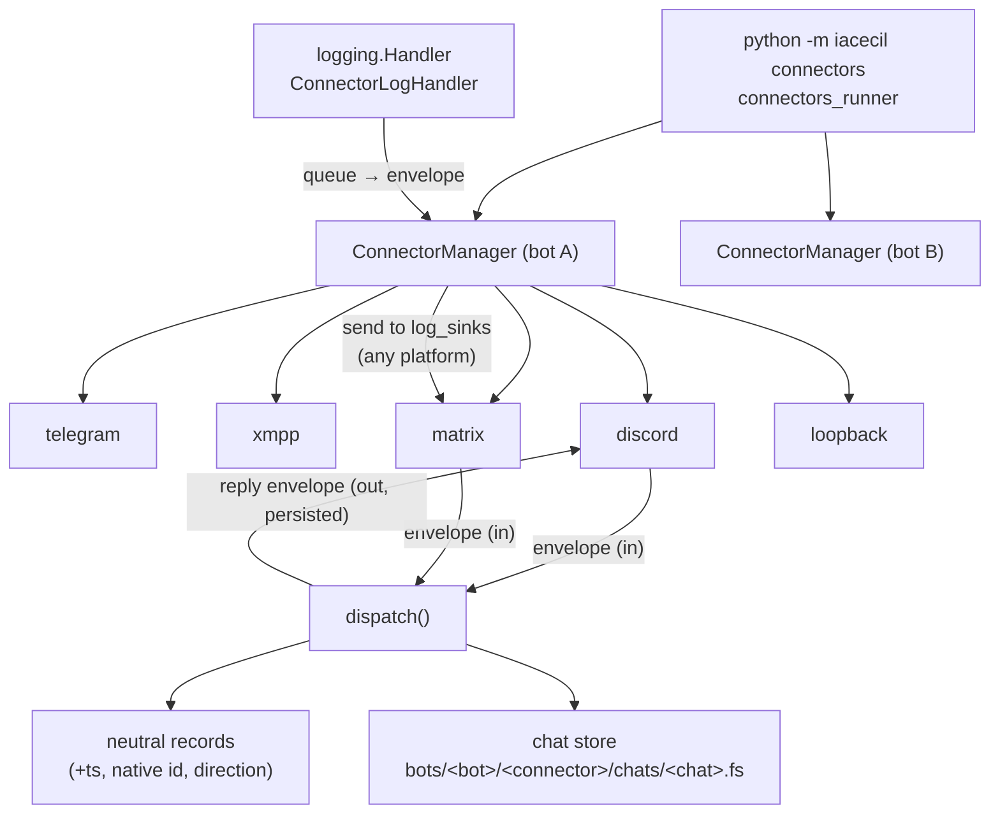

# feat: Echo everywhere — connector runner, discord + matrix, log sinks, persistence v2

## Summary

Add a connector-native runner (`python -m iacecil connectors`), discord and matrix connectors, platform-neutral log sinks, and a persistence model v2 (richer neutral records plus per-connector chat storage under a new filesystem-safe path scheme) — validated end to end by the echo plugin answering on every connector through a parametrized conformance suite.

---

## Problem Frame

Round 1 (see origin: docs/brainstorms/2026-06-10-connector-abc-requirements.md) shipped the connector ABC, loopback and xmpp connectors, the envelope, neutral persistence, and platform-blind personality commands. Three gaps remain and three couplings were never in round-1 scope:

- No production-shaped process ever starts `ConnectorManager` — a configured xmpp section never runs outside the loopback REPL (origin R7/AE1 gap).
- Operator logging is Telegram-only: `src/iacecil/controllers/log.py` needs `Dispatcher.get_current()` and sends to special Telegram chat ids, so the debug channel only works on the platform that is broken.
- Message storage is split: neutral records lack timestamps, native ids, and outbound messages; per-chat ZODB storage exists only for Telegram, under a path scheme (`bots/<numeric bot id>/chats/<chat id>.fs`) that has no connector dimension.
- Every new platform requires hand-editing the manager's hardcoded allowlist and `_is_active` credential rules, and every plugin must alias `add_handlers_<connector>` per platform (`src/plugins/echo.py` shows the smell).

This round adds the two connectors that expose these weaknesses (discord was prepared but inert; matrix was never anticipated) and fixes the weaknesses the exercise was designed to find.

---

## Requirements

**Runner**

- R1. `python -m iacecil connectors` loads `instance/_bots.py` and per-bot configs from `instance/bots/<name>.py` (same contract as production), builds one `ConnectorManager` per bot, and runs them concurrently under asyncio — no Quart, no legacy aiogram wrapper. `production.py` and `testing.py` are not modified.
- R2. A single connector or bot failure is logged and marked down without stopping sibling connectors, sibling bots, or the process (origin R2 carried forward).

**Connectors**

- R3. Discord connector implements the four-verb ABC: inbound guild/DM messages become envelopes (skipping the bot's own messages), outbound envelopes send to the channel in `conversation_ref` with reply support and 2000-character chunking.
- R4. Matrix connector via matrix-nio: login from config (access token preferred, password fallback), sync loop delivering plaintext `m.room.message` events as envelopes (skipping own messages), outbound send with a per-connector chunk limit, `next_batch` sync-token persistence across restarts, and a non-dispatching first sync (token acquisition only) so a tokenless first boot never replies to room backlog.
- R5. The echo plugin answers on every active non-telegram connector (loopback, xmpp, discord, matrix). Telegram replies stay owned by legacy aiogram handlers — the strangler-fig arbitration rule is preserved (docs/solutions/architecture-patterns/strangler-fig-dispatch-arbitration.md).

**Logging**

- R6. A bot config gains `log_sinks`: a list of `{platform, conversation_ref, level, tags, logger, verbose}` entries. `logger` optionally filters by logger-name prefix so subsystems route to different sinks (e.g. `iacecil.connectors.xmpp` at ERROR → a private Telegram group); `verbose` opts a trusted sink into full tracebacks. A stdlib `logging.Handler` subclass formats matching records into envelopes and delivers them through the bot's `ConnectorManager.send` path, so the operator channel can be any active connector — one or several, on any platform.
- R7. The handler never recurses (its own delivery failures must not re-enter it), never raises into the logging caller, and bridges synchronous `logging` calls into async delivery.
- R8. Logging changes are additive: existing functions in `src/iacecil/controllers/log.py` (`tecido_logger`, `furhat_logger`, `debug_logger`, `info_logger`, `exception_logger`, `zodb_logger`) are not removed or modified. New functions may supersede old ones one call site at a time in later work. (`tecido_logger` has a working implementation on another branch to be merged later — do not touch it.)

**Persistence**

- R9. The neutral message record gains: UTC timestamp, native message id, and direction (`in`/`out`). Outbound replies sent by the dispatch path are persisted, not just inbound messages.
- R10. Per-chat message storage extends to all connectors under a new path scheme: `instance/zodb/bots/<bot_id>/<connector_name>/chats/<chat_id>.fs`, with the connector name also recorded inside each stored message record. Telegram message storage continues (model changes, storage does not stop).
- R11. Every path component (`bot_id`, `connector_name`, `chat_id`) is sanitized to an alphabet valid on HFS+, NTFS, ext4, and btrfs simultaneously — including case-insensitive-collision safety (HFS+/NTFS) and NTFS reserved-name avoidance. Sanitization is deterministic and injective (two distinct inputs never map to the same component).
- R12. Existing legacy data (`instance/zodb/bots/<id>/chats/*.fs` and pickled aiogram history) stays readable; no migration (origin R10 carried forward).

**Contract**

- R13. Each connector class declares its own activation (e.g. a `required_keys` attribute or `is_active(conf)` classmethod). The manager activates any config section whose connector module exists and reports active — the hardcoded allowlist and per-platform `_is_active` rules in `src/iacecil/connectors/__init__.py` are removed.
- R14. Importing a plugin module has no side effects — registration happens only through loader functions. A plugin may implement per-connector loaders (`add_handlers_<connector>`) and/or a generic `add_envelope_handlers(manager)` covering connectors it does not special-case; for a given connector the per-connector loader wins over the generic one, and bare `add_handlers` remains the aiogram/telegram legacy loader. Core plugin functions stay connector-agnostic so loaders are thin registrations. Echo migrates: its three aliases collapse into one generic loader over the connector-agnostic `echo_envelope`.
- R15. A parametrized conformance suite runs the same contract checks against every connector: envelope construction from a fake native event, self-message guard, outbound chunking at the platform's limit, and an echo round-trip through a stub manager.

---

## Key Technical Decisions

- **matrix-nio for Matrix, current release** (user-confirmed): maintained async client; keeps protocol code out of the repo and leaves E2E possible later via `nio[e2e]`. Raw `/sync` over aiohttp rejected — owning sync/retry/backoff protocol code is the larger long-term cost than one dependency. Current matrix-nio requires `aiohttp>=3.10`, conflicting with aiogram 2.25.1's `aiohttp<3.9` pin; decision (user-confirmed): matrix wins — aiohttp moves to ≥3.10 and the conflict is pushed to the legacy aiogram side, whose pin is overridden/relaxed at lock time. Fallout there is absorbed by the already-EOL-contained legacy path.
- **discord.py for Discord** (user-confirmed): largest ecosystem and documentation; the connector only needs a thin four-verb slice, so library ergonomics beat hikari's cleaner-wrap advantage.
- **`bot_id` = bot config name** (user-confirmed): the new storage scheme keys on the `instance/bots/<name>.py` config name for all connectors. The Telegram numeric bot id appears only in legacy paths, which stay read-only.
- **Path sanitization by allowlist + percent-encoding**: keep `a-z`, `0-9`, `.`, `_`, `-` verbatim; percent-encode every other byte **including uppercase letters** (`A` → `%41`). Encoding uppercase makes components safe on case-insensitive filesystems (HFS+, NTFS) while staying injective and reversible. Additionally guard NTFS reserved basenames case-insensitively on the post-encoding component — lowercase `con`, `prn`, `aux`, `nul`, `com1`-`com9`, `lpt1`-`lpt9` pass the allowlist verbatim, so the guard encodes their leading character and accounts for the `.fs` suffix appended later (uppercase forms are already neutralized by the uppercase rule). A literal `%` in input is itself encoded (`%25`) so encoded outputs can never collide with raw inputs containing `%`.
- **New chat-store function, not a `zodb_logger` rewrite** (user-confirmed direction): a new persistence function accepts an envelope and writes a normalized record (connector included) into the new per-chat path. The connector dispatch path uses it for all platforms; Telegram call sites in `callbacks.py` migrate from `zodb_logger` to the new function one call site at a time, in keeping with R8's add-then-replace policy. Legacy `zodb_orm.log_message` remains for old data.
- **Envelope grows optional metadata fields** (`native_message_id`, `timestamp`, with direction inferred at persistence time): optional fields with defaults keep the frozen dataclass backward-compatible — existing construction sites compile unchanged.
- **Log delivery via per-manager queue**: `ConnectorLogHandler.emit` is synchronous and may fire from any thread; it enqueues, and a manager-owned task drains the queue through `manager.send`. Re-entrancy guard: the handler ignores records from its own module's logger namespace and sets a per-task in-delivery flag.
- **Sync-token storage as a plain file** (`instance/matrix/<sanitized bot_id>.next_batch`): a one-line token does not justify a ZODB database; plain file is inspectable and trivially testable.
- **Unit ordering puts contract v2 first**: discord and matrix then land as pure additions (one module + one config section each), which is itself the test of R13.

---

## High-Level Technical Design

Runner topology and message/log flow (directional guidance, not implementation specification):



Storage layout after this work:

```text
instance/zodb/
  people.fs                            # Person registry (unchanged)
  messages.fs                          # neutral records (gains ts/native id/direction)
  bots/<numeric tg id>/chats/<id>.fs   # legacy, read-only
  bots/<bot_id>/<connector>/chats/<chat_id>.fs   # new, all connectors, sanitized components
instance/matrix/<bot_id>.next_batch    # matrix sync token
```

---

## Implementation Units

### U1. Contract v2: connector-declared activation and single plugin entry point

- **Goal:** New platforms become "one module + one config section"; plugins stop aliasing per connector.
- **Requirements:** R13, R14, R5; origin R3/R4 evolved.
- **Dependencies:** none (first — U3/U4 land on top of it).
- **Files:** `src/iacecil/connectors/__init__.py`, `src/iacecil/connectors/base.py`, `src/iacecil/connectors/telegram.py`, `src/iacecil/connectors/xmpp.py`, `src/iacecil/connectors/loopback.py`, `src/plugins/echo.py`, `tests/test_manager.py`, `tests/test_plugin_loading.py`.
- **Approach:** `BaseConnector` gains a class-level activation declaration; each existing connector declares its credentials rule (telegram: `token`; xmpp: `jid`+`password`; loopback: `enabled`). `_load_connectors` iterates config sections and imports `iacecil.connectors.<name>`: `ModuleNotFoundError` is a silent debug-level skip (the section is not a connector — DefaultBotConfig carries ~12 credential-shaped non-connector dicts), while a module that exists but fails on import logs an error; allowlist and `_is_active` are deleted. `ConnectorManager` gains `send(envelope)` (routes to `self.connectors[envelope.platform].send`; warns once and drops when the platform is absent or down) and an optional `bot_id` constructor parameter defaulting to `"default"` (production's fallback bot name) so `testing.py` works unmodified and the U2 runner passes the config name. Telegram connector `send` gains 4096-char chunking (the conformance suite asserts it). Plugin loading per R14: importing a plugin has no side effects; `load_plugin` prefers `add_handlers_<connector>` for that connector, falls back to `add_envelope_handlers`, then warns. Echo collapses its three aliases into one generic loader over the connector-agnostic `echo_envelope`.
- **Patterns to follow:** dynamic `import_module` loading as used today in `src/iacecil/connectors/__init__.py`; warning-not-failure plugin loading (CONCEPTS.md "Plugin").
- **Test scenarios:**
  - Section with credentials + existing module → connector loads (telegram, xmpp, loopback each via their declared rule).
  - Non-connector section (`openai`, `coinmarketcap`) → silent debug-level skip, no error noise.
  - Connector module present but import fails (missing dependency) → error logged, siblings still load.
  - Section present but credentials empty → not activated.
  - `manager.send` routes to the right connector; absent or down platform → one warning, envelope dropped, no raise.
  - Telegram connector `send` with 4500-char text → two sends, each ≤4096, order preserved.
  - Plugin exposing only `add_envelope_handlers` registers on every non-telegram connector and is skipped (no warning storm) on telegram.
  - Plugin exposing only `add_handlers_xmpp` still binds under xmpp and warns elsewhere (compat preserved).
  - Plugin exposing both → per-connector loader wins for that connector, generic covers the rest.
  - Covers origin AE1 partially: telegram + xmpp config activates both connectors.
  - `tests/test_manager.py` assertions on the deleted "Unknown connector section" message are rewritten, not just re-run.
- **Verification:** existing manager/plugin tests pass with the allowlist gone; adding a fake `dummy` connector module in a test activates with zero manager edits.

### U2. Connector-native runner

- **Goal:** Long-running multi-bot, multi-connector process; xmpp (and new connectors) reachable outside the REPL.
- **Requirements:** R1, R2; closes origin R7/AE1 gap.
- **Dependencies:** U1.
- **Files:** `src/iacecil/controllers/_iacecil/connectors_runner.py` (new), `src/iacecil/__main__.py`, `Pipfile` (script alias), `tests/test_connectors_runner.py` (new).
- **Approach:** Mirror `production.py`'s config loading (`instance/_bots.py` list, `instance/bots/<name>.py` `BotConfig`, fallback to `DefaultBotConfig`) without the Quart/uvicorn wrapping; build one `ConnectorManager` per bot config; `asyncio.gather` the managers' `run_all()`; clean shutdown on `KeyboardInterrupt`. `__main__.py` gains a `connectors` branch before the default testing fallback. Per-bot exceptions are caught and logged so one misconfigured bot does not stop the rest (R2 at bot granularity; manager already handles connector granularity).
- **Patterns to follow:** config-loading sequence in `src/iacecil/controllers/_iacecil/production.py`; the `run_app` shape in `testing.py`.
- **Test scenarios:**
  - Config loader: missing `instance/_bots.py` falls back to default config without raising.
  - Two bot configs → two managers built, each with its own connector set.
  - One bot config raising on manager construction → other bot still runs, error logged.
  - `connectors` argv selects the new runner; no argv still selects the loopback REPL (no regression in mode dispatch).
- **Verification:** with an instance config carrying xmpp credentials, `pipenv run python -m iacecil connectors` connects xmpp and echo answers — the first production-shaped proof of origin AE1.

### U3. Discord connector

- **Goal:** Second prepared platform live; echo answers on Discord.
- **Requirements:** R3, R5, R15 participation.
- **Dependencies:** U1.
- **Files:** `src/iacecil/connectors/discord.py` (new), `Pipfile` (discord.py), `tests/test_discord.py` (new), `doc/` config example.
- **Approach:** discord.py client with `message_content` intent; `on_message` skips own messages and builds envelopes (`sender_ref`=user id, `conversation_ref`=channel id, `reply_ref` from message reference, native id threaded for U5); `send` resolves the channel, chunks at the connector's declared 2000-char limit, applies reply reference; `listen` runs the gateway until `disconnect`. Declares activation: non-empty `token` (R13 shape from U1).
- **Patterns to follow:** self-echo guard and failure-flag lifecycle in `src/iacecil/connectors/xmpp.py`; chunked send loop in the same file.
- **Test scenarios:**
  - Fake discord message event → envelope with correct platform/sender/conversation refs.
  - Own message (author == bot user) → no dispatch.
  - 4500-char outbound text → three sends, none exceeding 2000 chars, order preserved.
  - Reply envelope (`reply_ref` set) → send carries the message reference.
  - Gateway failure during `listen` propagates so the manager marks the connector down.
- **Verification:** echo round-trip in a test guild DM via the U2 runner; conformance suite (U8) green for discord.
- **Execution note:** dependency resolution check first — lock with `aiohttp>=3.10` (matrix KTD) and aiogram's `<3.9` pin overridden; confirm discord.py resolves and legacy telegram polling still works under the newer aiohttp before writing connector code.

### U4. Matrix connector

- **Goal:** First unanticipated platform; the architecture stress test passes.
- **Requirements:** R4, R5, R15 participation.
- **Dependencies:** U1.
- **Files:** `src/iacecil/connectors/matrix.py` (new), `Pipfile` (matrix-nio), `src/iacecil/config.py` (add empty `matrix` dict to `DefaultBotConfig` mirroring the discord stub), `tests/test_matrix.py` (new).
- **Approach:** matrix-nio `AsyncClient`; login via access token when configured, else password login; `sync_forever`-style loop delivering `RoomMessageText` as envelopes (`sender_ref`=mxid, `conversation_ref`=room id), skipping events whose sender is the bot's own mxid; send chunks at a declared limit safely under the 64 KiB event bound. When no sync token exists, the first sync is non-dispatching — it only acquires `next_batch`; dispatch starts from the second batch (no backlog echo on first boot). `next_batch` is written atomically (`.next_batch.tmp` then rename) to `instance/matrix/<sanitized bot_id>.next_batch` after each sync (sanitizer imported from the shared `path_utils` module, U5) and loaded on connect; an unreadable/corrupt token file logs a WARNING naming the file and the history-replay consequence before fresh-syncing. Plaintext rooms only; encrypted-room events are ignored with one warning per room. Declares activation: `homeserver` plus (`token` or `user`+`password`).
- **Patterns to follow:** xmpp connector's failure flag + `listen` loop contract; loopback's queue-free dispatch directly from the event callback.
- **Test scenarios:**
  - Fake `RoomMessageText` → envelope with platform `matrix`, room id as conversation ref.
  - Event with `sender` == own mxid → no dispatch.
  - Encrypted-room event → ignored, single warning.
  - Sync token round-trip: token persisted (atomically) after sync, loaded on next connect; corrupt/unreadable token file → WARNING naming file and replay consequence, fresh sync without raising.
  - Tokenless first sync delivering room backlog → zero dispatches, token persisted; second batch dispatches normally.
  - Outbound text over the chunk limit → split sends within bound.
  - Activation: homeserver+token active; homeserver alone inactive; password variant active.
- **Verification:** echo answers in a plaintext room joined by the bot via the U2 runner; restart does not re-echo old messages; conformance suite green for matrix.

### U5. Envelope and neutral persistence v2

- **Goal:** Stored history answers "when, which message, which direction"; outbound exists in storage.
- **Requirements:** R9, R12.
- **Dependencies:** none strictly; before U6 (chat store reuses the new fields). Connectors thread native ids as they land (U3/U4 include it; telegram/xmpp/loopback updated here).
- **Files:** `src/iacecil/models/envelope.py`, `src/iacecil/controllers/persistence/neutral.py`, `src/iacecil/controllers/persistence/path_utils.py` (new: `sanitize_component`, shared by U4 and U6), `src/iacecil/connectors/__init__.py` (dispatch persists outbound), `src/iacecil/connectors/telegram.py`, `src/iacecil/connectors/xmpp.py`, `src/iacecil/controllers/aiogram_bot/callbacks.py` (thread native id into emitted envelopes), `tests/test_envelope.py`, `tests/test_neutral_v2.py` (new), `tests/test_path_utils.py` (new).
- **Approach:** Envelope gains optional `native_message_id` and `timestamp` (defaulted, frozen-compatible). `persist_envelope` writes `timestamp` (UTC now when envelope carries none), `native_message_id`, and `direction` — a call-site parameter: in `dispatch()`, the inbound envelope persists as `in`, and after `reply_env` is constructed and `connector.send` returns, `persist_envelope(reply_env, direction="out")` is called on the reply branch. Readers tolerate old records lacking the fields (`.get` discipline). Return values stay plain data per docs/solutions/database-issues/zodb-objects-returned-after-connection-close.md. This unit also introduces `path_utils.sanitize_component()` (the sanitization KTD) as its own small module so U4's sync-token filename and U6's chat store import one canonical, separately-tested implementation.
- **Patterns to follow:** existing `persist_envelope` record-dict shape; id-not-object returns (solution doc above).
- **Test scenarios:**
  - Inbound envelope persisted with direction `in`, UTC timestamp, native id when provided.
  - Reply path: handler returns text → outbound record exists with direction `out` and same conversation ref (echo round-trip verifiable from storage — the round's stated goal).
  - Envelope without native id/timestamp persists with defaults, no raise.
  - Old-shape record (missing new keys) read back without KeyError.
  - Telegram-emitted envelope (callbacks chokepoint) carries `message_id` as native id.
- **Verification:** after a loopback echo exchange, `messages.fs` holds one `in` and one `out` record with timestamps.

### U6. Per-connector chat store with filesystem-safe paths

- **Goal:** Per-chat storage for all connectors under `bots/<bot_id>/<connector>/chats/<chat_id>.fs`; Telegram storage continues on the new model.
- **Requirements:** R10, R11, R12.
- **Dependencies:** U1 (manager `bot_id` parameter), U5 (envelope fields, `path_utils` sanitizer).
- **Files:** `src/iacecil/controllers/persistence/chat_store.py` (new: store, importing the U5 sanitizer), `src/iacecil/connectors/__init__.py` (dispatch writes through it for all platforms), `src/iacecil/controllers/aiogram_bot/callbacks.py` (first migrated call site: `message_callback` uses the new function alongside — then instead of — `zodb_logger`), `tests/test_chat_store.py` (new).
- **Approach:** `store_message(bot_id, envelope, direction)` builds the path from `path_utils.sanitize_component()` (U5) per component, then asserts the assembled absolute path stays under the zodb base directory (post-assembly containment check — belt-and-braces against a sanitizer regression or a connector setting a traversal-shaped `envelope.platform`). Opens the per-chat DB through a bounded LRU cache of open FileStorages (least-recently-used closed beyond the bound) and writes the normalized record including `connector` (=envelope.platform), native id, timestamp, direction. Keyed by uuid; native-id dedupe applies only when `native_message_id` is non-null — records without one (outbound, loopback) always store under their uuid key. The `bot_id` comes from the manager's constructor parameter (U1; default `"default"`), passed by the U2 runner; the migrated callbacks.py site sources it from `dispatcher.name`. Legacy `zodb_orm` untouched and still readable (R12). Test isolation relies on the autouse fixture in `tests/conftest.py` — never remove it.
- **Patterns to follow:** shared-DB open/cache helpers in `src/iacecil/controllers/persistence/neutral.py`; dedupe-by-message-id in `zodb_orm.log_message`.
- **Test scenarios:**
  - Sanitizer: `user@host.org` (xmpp), `!AbC:server.org` (matrix), `-1001234` (telegram group), lowercase reserved names `con`, `nul`, `com1`, empty string, dot-only, mixed-case pairs differing only by case, and escape-character injectivity inputs `%41` vs `A` and `a%2f` → all yield distinct, legal components on HFS+/NTFS/ext4/btrfs alphabets; round-trip decode restores the original.
  - Same chat twice → one `.fs` file, two records.
  - Two connectors, same chat id value → two distinct paths (connector level separates them).
  - Duplicate native message id in same chat → second write skipped.
  - Two envelopes without native ids in same chat → two records (no None-key collision).
  - Path-escape probe: `connector_name='../../../etc'` → assembled path stays under the zodb base (assertion fires or sanitizer neutralizes).
  - LRU bound: opening more chats than the bound → oldest handle closed, no fd growth beyond bound.
  - Telegram envelope through dispatch → record lands under `bots/<bot_id>/telegram/chats/...` while legacy reply ownership is unchanged.
- **Verification:** tree under the test ZODB root matches the Storage Layout sketch; all components match `^[a-z0-9._%-]+$`.

### U7. Log sinks and ConnectorLogHandler

- **Goal:** Operator logging configurable onto any connector; additive to `log.py`.
- **Requirements:** R6, R7, R8.
- **Dependencies:** U1 (manager send path); usable by U2's runner.
- **Files:** `src/iacecil/controllers/log_sinks.py` (new), `src/iacecil/config.py` (`log_sinks: list = []` on `DefaultBotConfig`), `src/iacecil/connectors/__init__.py` (`run_all` owns the drain-task lifecycle), `src/iacecil/controllers/_iacecil/connectors_runner.py` (attach handler per manager at startup), `tests/test_log_sinks.py` (new).
- **Approach:** `ConnectorLogHandler(manager, sinks)` — `emit()` filters by sink level, tags, and optional logger-name prefix (R6: e.g. `iacecil.connectors.xmpp` at ERROR routes to a private Telegram group while another sink takes everything at WARNING to a matrix room), formats the record, and enqueues `(sink, text)` thread-safely. Formatter contract (default): level, timestamp, logger name, message; tracebacks capped (~500 chars); in-flight envelope text and sender refs excluded — a per-sink `verbose: true` opts a trusted private sink into full tracebacks. `ConnectorManager.run_all()` starts and cancels the drain task (bounded flush-with-timeout on shutdown, then drop); the drain delivers a sink's records only once that sink's connector has connected — the bounded queue buffers boot-time records until then. The drain builds envelopes (`platform`, `conversation_ref` from sink) and calls `manager.send` (U1). Guards: records from the handler's own logger namespace are dropped; delivery failures log to a fallback stderr logger only; queue is bounded (drop-oldest) to survive error storms. `log.py` is not modified (R8).
- **Patterns to follow:** stdlib `logging.Handler` contract (`emit` must not raise); manager task lifecycle in `_run_connector`.
- **Test scenarios:**
  - `logger.error` with one matching sink → exactly one envelope sent to that platform/conversation.
  - Record below sink level → nothing sent.
  - Logger-prefix sink (`iacecil.connectors.xmpp`) → receives xmpp-logger records only; unrelated loggers filtered. Covers the "XMPP errors → private telegram group" acceptance scenario.
  - Two sinks on different platforms → both receive.
  - Default formatter excludes envelope text and caps traceback; `verbose: true` sink receives the full traceback.
  - `manager.send` raising during delivery → no recursion, fallback log only, subsequent records still delivered.
  - Record emitted before the sink's connector connects → buffered, delivered after connect.
  - Shutdown with queued records → bounded flush attempt, then clean cancel (no hang).
  - Burst of 10k records with a bounded queue → process stays responsive, oldest dropped, no raise into callers.
  - Sink naming an inactive platform → warning once, records skipped.
- **Verification:** in the U2 runner with a matrix sink configured, a forced `logger.error` appears in the matrix room; an xmpp-prefix sink pointed at a telegram group receives a forced xmpp connector failure.

### U8. Echo conformance suite

- **Goal:** This round's manual experiment becomes a permanent regression net every future connector inherits.
- **Requirements:** R15, R5; covers origin AE1's multi-connector spirit in test form.
- **Dependencies:** U1, U3, U4, U5 (suite covers all five connectors; U5 unifies the envelope contract — native ids, timestamps — the suite asserts).
- **Files:** `tests/test_connector_conformance.py` (new), small per-connector fake-event fixtures.
- **Approach:** Parametrize over connector descriptors (class, fake inbound event factory, declared chunk limit, own-identity setup). Shared checks: fake event → envelope field contract; own-message → no dispatch; text exceeding the declared limit → chunked sends each within limit; `/echotest` round-trip through a stub manager with echo's `add_envelope_handlers` registered (telegram asserted as persist-only, no reply — pinning the arbitration rule alongside the existing regression test).
- **Patterns to follow:** existing connector tests (`tests/test_xmpp.py`, `tests/test_telegram_envelope.py`, `tests/test_loopback.py`) for fake-event construction; arbitration regression shape in the strangler-fig solution doc.
- **Test scenarios:** the suite *is* the scenarios — one parametrized case per connector per check above (5 connectors × 4 checks), plus chunk boundary exact-limit and limit-plus-one cases per platform (telegram 4096, discord 2000, xmpp 4000, matrix declared limit).
- **Verification:** `pipenv run pytest tests/test_connector_conformance.py` green across all five connectors; removing a connector's chunk handling makes its case fail.

---

## Scope Boundaries

### Deferred to Follow-Up Work

- Envelope middleware/observer pipeline (round-2 ideation idea 6) — persistence and log taps land as direct calls this round; extract the pipeline when a third side-effect concern appears.
- Migrating remaining `zodb_logger` call sites in `callbacks.py` (`error_callback`, edited-message) to the chat store — U6 migrates the first call site; the rest follow the one-by-one replacement policy (R8/user direction).
- Merging the working `tecido_logger` from its branch.
- Webhook/Quart surface for the new runner (polling only this round).
- Matrix E2E room support (`nio[e2e]` + olm).
- XMPP MUC support (origin deferred question, still deferred).

### Outside this round

- Person-keyed allowlists/permissions (origin R11 second half).
- Telegram cutover to registry dispatch — arbitration seam stays exactly as documented.
- Migration of legacy ZODB data (origin R10).

---

## Risks & Dependencies

- **aiohttp pin conflict (direction decided; fallout owned by legacy):** current matrix-nio needs `aiohttp>=3.10`, aiogram 2.25.1 declares `aiohttp<3.9` — unresolvable as declared. Matrix wins: aiohttp moves to ≥3.10 and aiogram's metadata pin is overridden/relaxed at lock time. Before any connector code, verify legacy telegram polling still works under the newer aiohttp (U3 execution note); regressions there land on the legacy path and accelerate the aiogram exit rather than blocking matrix. discord.py needs no special handling (`aiohttp>=3.7.4,<4`).
- **Discord message-content intent:** must be enabled in the developer portal or `on_message` receives empty text. Document in the `doc/` config example; connector logs a clear hint when all inbound texts arrive empty.
- **Case-insensitive path collisions:** mitigated by encoding uppercase (KTD); the sanitizer's injectivity tests are the proof obligation.
- **ZODB file-handle growth:** one `.fs` per chat per connector multiplies open FileStorages on busy bots. The legacy per-chat path opens and closes per call (`zodb_orm.get_db` / `croak_db` in `finally`); only neutral.py's two singleton DBs cache. The chat store therefore commits to a bounded LRU cache of open per-chat FileStorages (least-recently-used closed beyond the bound) — hot-chat performance without unbounded fd growth.
- **matrix-nio sync semantics:** first sync without a token can deliver a large backlog; `next_batch` persistence (R4) plus ignoring events older than connect time guards re-echo storms.

---

## Sources & Research

- docs/brainstorms/2026-06-10-connector-abc-requirements.md — origin requirements (R-IDs referenced as "origin R*").
- docs/ideation/2026-06-10-platform-agnostic-ideation.html — round-2 ranked ideas this plan executes (ideas 1-5, 7; idea 6 deferred).
- docs/solutions/architecture-patterns/strangler-fig-dispatch-arbitration.md — arbitration rule R5/U8 must preserve.
- docs/solutions/database-issues/zodb-objects-returned-after-connection-close.md — return-plain-data rule for U5/U6.
- docs/solutions/test-failures/tests-deleted-real-instance-zodb.md + `tests/conftest.py` autouse fixture — test isolation U5/U6/U8 depend on.
- `src/iacecil/controllers/persistence/zodb_orm.py` (`log_message`) — legacy per-chat path scheme and dedupe behavior U6 evolves.
- `src/iacecil/controllers/log.py` — the additive-only surface R8 protects.

---

## Deferred / Open Questions

### From 2026-06-10 review

- **Test isolation fixture does not cover new storage surfaces** — U6 / U4 test scenarios (P1, feasibility, confidence 75)

  Tests for the new chat store and matrix sync token can write to (and a cleanup bug can delete) real `instance/` data — a failure mode this repo has already suffered once (docs/solutions/test-failures/tests-deleted-real-instance-zodb.md). The autouse fixture in tests/conftest.py patches only `neutral.zodb_path` and resets neutral's DB singletons; the new `chat_store.py` will have its own module-level DB-handle cache and path derivation the fixture never touches, and U4 hardcodes `instance/matrix/<bot_id>.next_batch` outside any patched root.

- **Matrix password credential stored in plaintext instance config** — U4 / R4 (P2, security-lens, confidence 75)

  The password fallback introduces a net-new credential type with the same storage model as bearer tokens, but a password is the account's recovery mechanism — a leak cannot be rotated away. Consider marking `password` bootstrap-only (exchange for an access token on first run, then remove from config) and logging a startup warning when password login is used.
