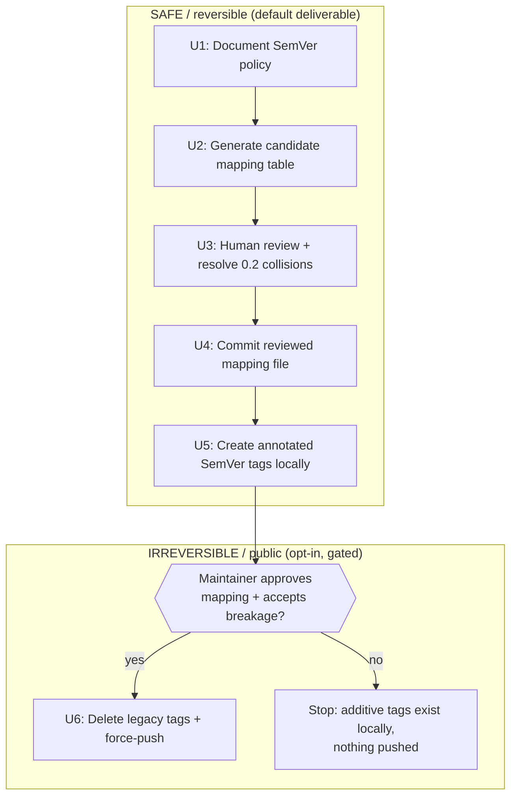

# chore: Adopt SemVer and retroactively retag the v0.0.0.0 history

## Summary

The repo carries **191 tags** in an inconsistent 4-segment `MAJOR.MINOR.PATCH.BUILD`
scheme (`0.0.2.0`, `0.1.6.12`, `0.2.14.5`), mixed with a handful of 3-segment tags
(`0.2.6`, `0.2.19`), four non-version labels (`alpha`, `organic`, `stable`, `0.2`,
`furhatgpt`), and two already-SemVer tags (`v0.3.0`, `v0.3.1`). The goal is to adopt
[SemVer 2.0.0](https://semver.org) as the project's versioning standard and retroactively
map the legacy numeric tags onto it.

The plan delivers this in two separable halves so the **safe, reversible** work (adopt
SemVer going forward + produce and review a complete mapping table) is fully decoupled
from the **destructive, irreversible** work (deleting and force-pushing rewritten tags to
the public GitHub remote). The destructive half is gated behind explicit maintainer
approval of the generated mapping and an explicit acknowledgement of the breakage it
causes.

**Critical finding up front:** 190 of the 191 tags are already published on
`git@github.com:iuriguilherme/iacecil.git`. Rewriting them is a force-push to public
history — it breaks every existing clone, fork, GitHub release link, and pinned reference.
SemVer governs the *format* of versions; it does **not** endorse rewriting *published*
tags. The Git community's standing rule is that published tags are immutable. This plan
therefore treats the additive, non-destructive path as the default recommendation and the
destructive rewrite as an opt-in the maintainer must consciously choose.

---

## Problem Frame

### What exists today

- **191 tags total**, all *lightweight* (each points directly at a commit; no annotation
  object, no tagger, no message).
- **190 of them are on the remote** (`git ls-remote --tags origin` → 190).
- Tag families:
  - 4-segment numeric: `0.0.2.0` … `0.2.14.5` (the bulk).
  - 3-segment numeric interleaved into the `0.2` lineage: `0.2.6`, `0.2.7`, `0.2.8`,
    `0.2.9`, `0.2.10`, `0.2.11`, `0.2.12`, `0.2.13`, `0.2.14`, `0.2.15`, `0.2.16`,
    `0.2.17`, `0.2.18`, `0.2.19`.
  - Already SemVer: `v0.3.0`, `v0.3.1` (the two newest; current `__version__ = "0.3.1"`).
  - Non-version labels: `alpha`, `organic`, `stable`, `0.2`, `furhatgpt`. The first four
    all point at the **same** commit `172b12f8`; `furhatgpt` points at `c9d5aa02`.
- **No release tooling** exists (no CI workflows, no Makefile, no bump script). Versioning
  is manual.
- The source of version truth is `src/iacecil/_version.py` (`__version__: str = "0.3.1"`),
  read by `setup.cfg` via `attr:`. `pyproject.toml` **hardcodes** `version = "0.3.1"`
  separately (a drift hazard, noted as adjacent scope).

### Why a naive algorithm is unsafe (empirically proven)

The second segment is the project's true, monotonic minor across the whole history
(`0.0.*` → `0.1.*` → `0.2.*` → `0.3.*`). That suggests folding 4-segment `0.MINOR.B.C`
into a 3-segment patch under `0.3.0`. A candidate heuristic — `0.MINOR.(B*100 + C)`,
treating 3-segment `0.MINOR.B` as `B.0` — was generated and collision-checked against the
real tag set. It produces **7 collisions**, all in the `0.2` lineage, e.g.:

| Tag A | commit | Tag B | commit | naive key | result |
|-------|--------|-------|--------|-----------|--------|
| `0.2.8`  | `c212422f` | `0.2.8.0`  | `b14a03ab` | `v0.2.800`  | **distinct commits collide** |
| `0.2.9`  | `eefa15df` | `0.2.9.0`  | `a6bc920c` | `v0.2.900`  | **distinct commits collide** |
| `0.2.10` | `b1dacaba` | `0.2.10.0` | `2cb3c870` | `v0.2.1000` | **distinct commits collide** |
| `0.2.13` | `6194615b` | `0.2.13.0` | `7a9747ef` | `v0.2.1300` | **distinct commits collide** |

(`0.2.11`, `0.2.12`, `0.2.14` collide the same way.) These pairs are **genuinely different
releases**. No pure folding rule can separate them, because the legacy scheme reused the
same `MINOR.B` coordinates for both a 3-segment and a 4-segment release. **Conclusion: the
mapping cannot be fully algorithmic. It must be machine-generated then human-reviewed, with
the ~7 ambiguous `0.2` pairs resolved by hand.**

### Scope of the deliverable

This is versioning/release-hygiene infrastructure work, not application code. The output
is: a documented SemVer policy, a reviewed mapping table (legacy tag → SemVer tag), a
reproducible retag script, and — only on explicit approval — the executed rewrite.

---

## Requirements

- **R1** Adopt SemVer 2.0.0 as the documented versioning standard for the project going
  forward, including a chosen `v`-prefix convention (the two newest tags already use `v`).
- **R2** Produce a **complete, reviewed** mapping from every legacy numeric tag to a valid
  SemVer tag, with zero collisions and preserved chronological precedence.
- **R3** Decide and document the treatment of non-version label tags (`alpha`, `organic`,
  `stable`, `0.2`, `furhatgpt`) — they are not releases and must not be force-fit.
- **R4** Make every legacy tag's commit reachable under its new SemVer name **without data
  loss** — annotated tags created at the same commits.
- **R5** Keep the destructive, irreversible step (delete + force-push rewritten tags to the
  public remote) gated behind explicit maintainer approval and a recorded acknowledgement
  of breakage. No force-push happens without it.
- **R6** Provide a reproducible, re-runnable script so the mapping can be regenerated,
  audited, and applied deterministically (no hand-typed `git tag` for 191 entries).
- **R7** Preserve a permanent record of the old→new mapping (committed to the repo) so the
  legacy version numbers remain discoverable after the rewrite.

---

## Key Technical Decisions

### KTD1 — Default to additive (non-destructive); make the rewrite opt-in

**Decision:** Treat creating new annotated SemVer tags at the legacy commits as the default
deliverable. The destructive `git tag -d` + `git push --force --tags` step is a separate,
explicitly-gated unit (U6) the maintainer opts into.

**Rationale:** 190 tags are public. Force-pushing rewritten tags is irreversible from the
consumer's side and breaks clones, forks, and release links. SemVer does not require it.
The additive path achieves "the history is navigable under SemVer names" with zero
breakage; the destructive path additionally *removes* the old names, which is what the user
literally asked for but carries real cost. Surfacing both lets the maintainer choose with
eyes open rather than discovering the breakage after the push.

**Alternatives considered:** (a) Force-push only, no additive safety net — rejected as the
default because a mistake in the mapping becomes a public, irreversible event. (b) Never
rewrite, only document — rejected as the *sole* outcome because the user explicitly asked
to rewrite; offered instead as the conservative arm of U6.

### KTD2 — Mapping is machine-generated, then human-reviewed; `0.2` ambiguities resolved by hand

**Decision:** Generate a candidate mapping with a documented heuristic, emit it as a
reviewable table, and require human resolution of the ~7 colliding `0.2` pairs before any
tags are created.

**Rationale:** Proven above — no pure algorithm separates `0.2.8` from `0.2.8.0`. The
heuristic gets ~184/191 right mechanically; the remainder need a judgment call (e.g., order
the two by `creatordate` and assign consecutive patch numbers).

**Recommended heuristic for the mechanical 184:** `0.MINOR.B.C` → `v0.MINOR.(B*100 + C)`;
3-segment `0.MINOR.B` → `v0.MINOR.(B*100)`; existing `v0.3.x` kept as-is. This keeps every
legacy release **below `0.3.0`** (so the current latest tag stays latest), stays valid
SemVer, and is monotonic within each minor. **Downside:** patch numbers inflate (`0.0.11.10`
→ `v0.0.1110`), which is ugly but harmless. The maintainer may instead prefer a flat
**chronological renumber** (`v0.0.1`, `v0.0.2`, … by `creatordate`) — recorded as the
Open Question OQ1, since it changes every resulting number.

### KTD3 — Create annotated tags at the original commits, preserving authorship dates

**Decision:** New SemVer tags are **annotated** (`git tag -a`) created at each legacy tag's
exact commit, with `GIT_COMMITTER_DATE`/tagger date set from the legacy tag's commit date so
the timeline reads correctly.

**Rationale:** Legacy tags are lightweight (no metadata). Moving to annotated tags is itself
a hygiene upgrade and lets the tag message record the legacy name (satisfies R7 inline, in
addition to the committed mapping file). Pinning the tagger date keeps `--sort=creatordate`
sane after the rewrite.

### KTD4 — Leave label tags as labels

**Decision:** `alpha`, `organic`, `stable`, `furhatgpt`, and the bare `0.2` are **not**
remapped to SemVer. Keep them untouched (or, optionally, document them as channel labels).

**Rationale:** They aren't releases — four of them share one commit. Forcing them into
SemVer would invent version numbers that never existed. `0.2` is ambiguous (label vs.
truncated version); since it shares `alpha`/`stable`'s commit it is treated as a label.

---

## High-Level Technical Design

### Two-track delivery



### Mapping pipeline (U2)

```
read: git tag -l --sort=creatordate  +  per-tag commit + creatordate
  │
  ├─ classify: 4-seg numeric | 3-seg numeric | already-vSemVer | label
  ├─ apply heuristic (KTD2) to numeric tags
  ├─ detect collisions (same target key, distinct commits)
  └─ emit: docs/versioning/tag-mapping.tsv   (legacy<TAB>candidate<TAB>commit<TAB>status)
            where status ∈ {ok, COLLISION-needs-review, label-keep, already-semver}
```

The `COLLISION-needs-review` rows are the human checkpoint in U3.

---

## Output Structure

```
docs/
  versioning/
    SEMVER.md            # U1 — the adopted policy
    tag-mapping.tsv      # U4 — reviewed, committed legacy→semver map (source of truth)
scripts/
  versioning/
    gen_tag_mapping.py   # U2 — generates candidate mapping.tsv from git
    apply_tag_mapping.sh # U5 — creates annotated tags from the reviewed mapping.tsv
    rewrite_remote.sh    # U6 — gated: delete legacy + force-push (opt-in)
```

---

## Implementation Units

### U1. Document the SemVer policy

**Goal:** Establish SemVer 2.0.0 as the project standard so the retag has a written rule to
conform to.

**Requirements:** R1, R3.

**Dependencies:** none.

**Files:** `docs/versioning/SEMVER.md` (create).

**Approach:** State the adopted standard (link semver.org), the `v`-prefix convention
(matching `v0.3.x`), how `MAJOR`/`MINOR`/`PATCH` are incremented for this project, the
0.x "pre-1.0, API may break on minor" caveat, the treatment of label tags (`alpha`,
`stable`, etc.) as channel markers not releases, and a pointer to `tag-mapping.tsv` for
historical equivalences. Keep it short and prescriptive.

**Patterns to follow:** Repo prose docs under `docs/` (e.g., `docs/solutions/` frontmatter
style) for tone; `CONCEPTS.md` for glossary voice.

**Test scenarios:** `Test expectation: none — documentation unit, no behavioral change.`

**Verification:** `SEMVER.md` exists, links semver.org, states the `v`-prefix rule and the
label-tag policy, and references the mapping file.

---

### U2. Generate the candidate mapping table

**Goal:** Mechanically produce a complete legacy→SemVer candidate map and flag the
collisions that need human resolution.

**Requirements:** R2, R6.

**Dependencies:** U1 (policy fixes the `v`-prefix and rules).

**Files:** `scripts/versioning/gen_tag_mapping.py` (create); emits
`docs/versioning/tag-mapping.candidate.tsv`.

**Approach:** Read every tag with its commit SHA and `creatordate`. Classify into
{4-seg, 3-seg, already-semver, label}. Apply the KTD2 heuristic to numeric tags. Compute
the target key per tag; group by target key; any group with >1 distinct commit is marked
`COLLISION-needs-review`. Output a stable, sorted TSV: `legacy \t candidate \t commit \t
creatordate \t status`. The script is pure-read (no tag mutation) and re-runnable. Make the
heuristic swappable (a `--strategy fold|chronological` flag) so OQ1 can be answered without
a rewrite.

**Patterns to follow:** Python 3.11, stdlib only (`subprocess` to call `git`), matching the
repo's Python target. No new dependencies.

**Test scenarios:**
- Happy path: given the current 191 tags, every tag appears exactly once in the output.
- Collision detection: the 7 known `0.2` pairs (`0.2.8`/`0.2.8.0`, `0.2.9`/`0.2.9.0`,
  `0.2.10`/`0.2.10.0`, `0.2.11`/`0.2.11.0`, `0.2.12`/`0.2.12.0`, `0.2.13`/`0.2.13.0`,
  `0.2.14`/`0.2.14.0`) are each flagged `COLLISION-needs-review`.
- Label handling: `alpha`, `organic`, `stable`, `0.2`, `furhatgpt` get status
  `label-keep`, no SemVer candidate assigned.
- Already-SemVer: `v0.3.0`, `v0.3.1` pass through unchanged with status `already-semver`.
- Validity: every assigned candidate parses as valid SemVer and is `< 0.3.0` (fold
  strategy).
- Determinism: two runs on the same repo produce byte-identical output.
- Strategy flag: `--strategy chronological` yields a strictly increasing, collision-free
  sequence covering all numeric tags.

**Verification:** Running the script on the repo emits a TSV with 191 rows, exactly the 7
collision pairs flagged, all non-label candidates valid SemVer.

---

### U3. Human review and collision resolution

**Goal:** Turn the candidate table into an approved, collision-free mapping.

**Requirements:** R2.

**Dependencies:** U2.

**Files:** `docs/versioning/tag-mapping.tsv` (create — the reviewed source of truth,
derived from the candidate).

**Approach:** Maintainer (or planner, with maintainer sign-off) reviews
`tag-mapping.candidate.tsv`, resolves each `COLLISION-needs-review` row by hand — the
recommended resolution is to order the colliding pair by `creatordate` and assign
consecutive patch numbers (e.g., `0.2.8.0` earlier → `v0.2.800`, `0.2.8` later →
`v0.2.801`), or vice-versa per actual dates — and confirms the label rows. Save the
resolved, fully-`ok` table as `tag-mapping.tsv`. This unit is the **gate** for OQ1
(fold vs. chronological): the chosen strategy is locked here.

**Patterns to follow:** n/a (review artifact).

**Test scenarios:**
- Invariant: `tag-mapping.tsv` has no `COLLISION-needs-review` rows remaining.
- Invariant: every target SemVer value is unique across the file.
- Invariant: row count equals the live tag count; no legacy tag dropped.

**Verification:** A validator pass (can reuse U2 script in `--validate tag-mapping.tsv`
mode) reports zero collisions and full coverage.

---

### U4. Commit the reviewed mapping as the permanent record

**Goal:** Make the old→new equivalence permanent and discoverable (R7), independent of the
tags themselves.

**Requirements:** R7.

**Dependencies:** U3.

**Files:** `docs/versioning/tag-mapping.tsv` (commit); `docs/versioning/SEMVER.md` (link to
it).

**Approach:** Commit the reviewed table. This survives even if tags are later force-pushed,
so anyone who remembers `0.2.14.5` can find its SemVer equivalent.

**Test scenarios:** `Test expectation: none — committed data file.`

**Verification:** `git log -- docs/versioning/tag-mapping.tsv` shows the committed file;
`SEMVER.md` links it.

---

### U5. Create annotated SemVer tags locally (additive, reversible)

**Goal:** Materialize the new SemVer tags at the correct commits, locally, without touching
the remote — the safe deliverable.

**Requirements:** R4, R6.

**Dependencies:** U4.

**Files:** `scripts/versioning/apply_tag_mapping.sh` (create).

**Approach:** Read `tag-mapping.tsv`; for each `ok` row, create an **annotated** tag
(`git tag -a <new> <commit> -m "SemVer retag of <legacy> (see docs/versioning/tag-mapping.tsv)"`)
with tagger date pinned to the legacy commit's date (KTD3). Idempotent: skip if the new tag
already exists with the same target. Does **not** delete legacy tags and does **not** push.
After this unit, both legacy and new tags coexist locally — fully reversible by deleting the
new tags.

**Patterns to follow:** POSIX `sh`, `git` only. No force, no push, no delete in this script.

**Test scenarios:**
- Happy path: every `ok` row produces an annotated tag at the expected commit SHA.
- Idempotency: re-running creates no duplicates and errors on no mismatches.
- Date pinning: a spot-checked new tag's tagger date equals its legacy commit date.
- Safety: after running, all 191 legacy tags still exist locally (nothing deleted);
  `git ls-remote --tags origin` count is unchanged (nothing pushed).
- Coexistence: `git tag -l 'v0.*'` shows both the legacy and new names.

**Verification:** Local tag count increases by the number of `ok` rows; remote unchanged;
spot-checked tags annotated and at correct commits.

---

### U6. (Gated, opt-in) Delete legacy tags and force-push the rewrite

**Goal:** Execute the destructive rewrite the user requested — **only** after explicit
approval and breakage acknowledgement.

**Requirements:** R5.

**Dependencies:** U5, plus an explicit maintainer go-ahead recorded outside the plan.

**Files:** `scripts/versioning/rewrite_remote.sh` (create).

**Approach:** This script is the only place deletion/force-push lives. It **must**:
1. Refuse to run unless an explicit confirmation flag is passed (e.g.,
   `CONFIRM_REWRITE=yes` and an interactive `y/N` prompt echoing the breakage warning).
2. Print the full list of tags to be deleted and re-pushed and require confirmation.
3. Delete legacy tags locally and on the remote, push the new annotated tags
   (`git push origin --tags` + targeted `git push origin :refs/tags/<legacy>` deletes).
4. Recommend (not auto-create) a GitHub announcement noting the tag history was rewritten.

**Execution note:** This is the irreversible, outward-facing step. It is **out of scope for
automated pipeline execution** — `ce-work` must stop here and require a human to run U6
manually after reviewing U5's output. Do not auto-run as part of LFG.

**Patterns to follow:** Defensive shell — `set -euo pipefail`, explicit confirmation gate,
dry-run default (`--apply` to actually mutate).

**Test scenarios:**
- Gate: without the confirmation flag, the script exits non-zero and mutates nothing.
- Dry-run default: running without `--apply` prints the plan and touches no refs (verify
  remote tag count unchanged).
- (Manual, post-approval only) Apply: remote shows the new SemVer tags and no legacy
  numeric tags; `tag-mapping.tsv` still resolves old names.

**Verification:** Dry-run prints an accurate deletion/push plan and changes nothing; the
gate provably blocks accidental execution.

---

## Scope Boundaries

### In scope
- SemVer policy doc, reviewed mapping table, additive annotated tags, and a gated
  destructive-rewrite script.

### Deferred to Follow-Up Work
- **Version-source unification:** `pyproject.toml` hardcodes `version = "0.3.1"` while
  `setup.cfg` reads `src/iacecil/_version.py`. Consolidating to a single source is real
  hygiene but adjacent to tag rewriting — separate PR.
- **Release automation:** there is no bump/tag CI. A future `release` workflow that tags
  from `__version__` would prevent future drift, but is out of this plan's scope.

### Out of scope (not this task)
- Rewriting commit history or commit messages (only tags are touched).
- Changing the application's runtime versioning behavior.

---

## Open Questions

- **OQ1 (locked in U3): Fold vs. chronological renumber.** The recommended **fold**
  heuristic preserves recognizable minor lineages but inflates patch numbers
  (`v0.0.1110`). A **chronological** renumber (`v0.0.1`, `v0.0.2`, …) is cleaner-looking
  but discards the original numbers' shape. Both are collision-free; the U2 script supports
  both via `--strategy`. The maintainer picks one at U3. *Planner recommendation: fold,
  because it keeps a visible link to the old numbers and keeps everything under `0.3.0`.*
- **OQ2: `v` prefix on historical tags.** `v0.3.x` uses `v`; legacy tags do not. Plan
  assumes new tags get the `v` prefix uniformly for consistency. Confirm at U1.

---

## Risks & Dependencies

- **R-risk1 — Irreversible public breakage (U6).** Force-pushing rewritten tags breaks
  clones, forks, and GitHub release links permanently. *Mitigation:* U6 is gated, dry-run by
  default, opt-in, and never auto-run by the pipeline; the additive path (U5) is the safe
  default; the mapping file (U4) preserves old→new forever.
- **R-risk2 — Mapping error baked into public history.** A wrong mapping pushed in U6 is
  itself a public event. *Mitigation:* mandatory human review (U3) + validator + the
  additive local tags exist for inspection before any push.
- **R-risk3 — Lost releases via collision.** Proven 7 `0.2` collisions; an un-reviewed
  script would silently drop one of each pair. *Mitigation:* U2 flags every collision; U3
  blocks until resolved; U5 only consumes a fully-`ok` table.
- **R-risk4 — Date/order scrambling.** Naive retag would reset tag ordering. *Mitigation:*
  KTD3 pins tagger dates to legacy commit dates.

**Dependencies:** Local `git` with push access to `origin`; maintainer availability to
review U3 and approve U6. No new runtime dependencies (scripts use stdlib Python + git).

---

## Sources & Research

- [Semantic Versioning 2.0.0](https://semver.org) — the adopted standard (R1).
- Live repo inspection (this session): 191 tags, 190 on remote, all lightweight; collision
  analysis proving 7 distinct-commit `0.2` collisions under the fold heuristic; version
  source in `src/iacecil/_version.py` + `setup.cfg` `attr:`, with `pyproject.toml` drift.
- Git community practice on the immutability of published tags (informs KTD1 / R-risk1).
