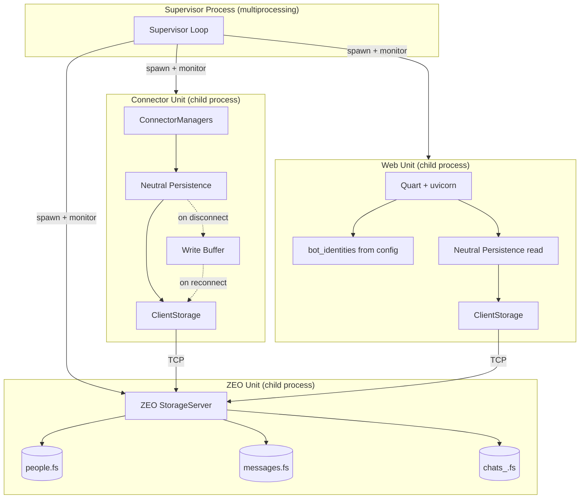

# refactor: Decouple web from connectors — slice 1: survival + shared storage

## Summary

Split the production runtime into three sibling OS processes (ZEO server, connector unit, web unit) under a `multiprocessing`-based supervisor, replacing the current fused Quart+connectors setup. The storage layer migrates from exclusive-lock `FileStorage` to `ZEO.ClientStorage` so both processes share data safely. Because a ZEO server serves a fixed set of named storages decided at startup, while the chat store creates a new `.fs` file whenever a new chat appears, the per-chat files are first consolidated into one `chats` storage per bot, keyed by connector and chat id inside a BTree. Web read routes are re-sourced from config-derived bot identity instead of live aiogram dispatchers; web control routes are commented out pending slice 2's control channel.

---

## Problem Frame

The connector system runs as a task on uvicorn's event loop — killing the web process kills every bot. The coupling is concentrated in `src/iacecil/views/quart_app/__init__.py:114-166` (`before_serving` / `after_serving` hooks). Two boot hazards block a naive split: `FileStorage` exclusive locks crash the second process, and removing dispatchers from Quart raises `AttributeError` across ~17 web route sites. (see origin: `docs/brainstorms/completed/2026-06-16-decouple-web-survival-slice1-requirements.md`)

---

## Assumptions

*This plan was authored without synchronous user confirmation. The items below are agent inferences that fill gaps in the input — un-validated bets that should be reviewed before implementation proceeds.*

- ZEO topology: one ZEO server process per `instance/zodb/` root, hosting a fixed, startup-known set of named storages — `people`, `messages`, and one `chats` storage per bot. No storage is created while the server runs (see R13 and the topology decision below; user-confirmed 2026-09-17).
- The supervisor does not need a new `__main__.py` mode name — `production` is remapped to launch the supervisor, which then starts the three sibling units.
- Backoff strategy: exponential backoff (1s, 2s, 4s, … capped at 60s) with a reset-on-success window of 120s.
- The connector unit's liveness ping ("Mãe tá #on/#off") is sent from the connector runner's startup/shutdown, reusing the existing `dispatcher.bot.send_message` pattern that `connectors_runner.py` already has access to (via the aiogram setup it performs).
- `ZlibStorage` wraps `ClientStorage` the same way it wraps `FileStorage` — composability is documented in ZODB and is the standard pattern.
- The neutral persistence singletons (`_people_db`, `_messages_db` in `neutral.py`) switch from `FileStorage` to `ClientStorage` behind a config flag, with the same `ZlibStorage` wrapping.

---

## Requirements

- R1. Connector system runs in its own OS process via `python -m iacecil connectors`, owning all ConnectorManagers, every connector, aiogram polling, the scheduler, and persistence writes — importing no Quart.
- R2. Web unit runs uvicorn+Quart with no ConnectorManager. The `before_serving` hook is stripped of connector/dispatcher setup (lines 123-145) and the `after_serving` hook is neutralized (lines 150-164).
- R3. Connector unit is never a child of the web process — survival polarity preserved by construction.
- R4. Multiprocessing supervisor starts ZEO, connector, and web units as sibling children, with restart-on-exit and backoff.
- R5. Supervisor uses `spawn` start method. Config crosses process boundary by name/path, not as live objects.
- R6. `__main__.py` `production` mode re-maps to supervisor; `connectors`/`connectors_v3` unchanged; testing/fpersonas/furhat untouched.
- R7. SIGTERM to supervisor is forwarded to all children for clean shutdown.
- R8. Every web read of `current_app.dispatchers` / `dispatcher.bot` is resolved. Read paths migrated to config-sourced identity; control paths (`polling`/`send_message`/`updates`) commented out.
- R9. ZEO server runs as sibling unit, owning on-disk `FileStorage`. Both units connect via `ClientStorage`.
- R10. `get_db` and neutral persistence connect via `ClientStorage` when ZEO address configured.
- R11. Connector unit buffers failed neutral-record writes during ZEO outage and flushes on reconnect.
- R12. "Mãe tá #on/#off" fires from connector unit startup/shutdown, not web.
- R13. The per-chat stores are consolidated into one `chats` storage per bot, keyed by `(connector, chat_id)` inside a BTree, so the set of ZEO storage names is fixed at server startup and a new chat never needs a new storage. The public `chat_store` surface (`store_message` and its dedupe, sanitization, and isolation behavior) is unchanged, and existing per-chat `.fs` data is migrated by a one-time script.

**Origin acceptance examples:** AE1 (R3), AE2 (R4), AE3 (R4), AE4 (R8, R9, R10), AE5 (R9), AE6 (R4, R9, R11), AE7 (R12)

---

## Scope Boundaries

- Connector-control channel (Unix socket, JSON protocol) — slice 2
- `restart_connector` / `toggle_connector` / `toggle_bot` / `health` commands — slice 2
- Control-channel security (socket permissions, `SO_PEERCRED`) — slice 2
- `status.json` heartbeat writer and liveness/health web view — slice 2
- Admin control-route rewrite onto control commands — slice 2
- systemd units as production supervisor — named dependency, not built here
- Per-connector subprocess isolation — future extension
- ZEO authentication / network exposure — ZEO binds local-only this slice

### Deferred to Follow-Up Work

- Consolidating the legacy `zodb_orm` per-chat storages used by plugins and legacy web reads. Slice 1 consolidates the clean `chat_store` layer only (R13); legacy per-chat `.fs` files stay on `FileStorage`, opened read-only by the web unit.
- Write-buffer persistence to disk (R11 accepts loss on connector-unit crash)

---

## Context & Research

### Relevant Code and Patterns

- **Coupling site:** `src/iacecil/views/quart_app/__init__.py:114-166` — `before_serving` constructs ConnectorManager per dispatcher, schedules `manager.run_all()` on the loop, sends "Mãe tá #on"; `after_serving` sends "#off" and closes storage
- **Connector runner:** `src/iacecil/controllers/_iacecil/connectors_runner.py` — already boots independently without Quart, uses `load_bot_configs()`, creates ConnectorManagers, runs `asyncio.run(run_managers(managers))`
- **Production runner:** `src/iacecil/controllers/_iacecil/production.py` — top-level module that fuses aiogram_startup + quart_startup + uvicorn
- **Entry point:** `src/iacecil/__main__.py:78-103` — mode dispatch via `sys.argv[1]`
- **Storage:** `src/iacecil/controllers/persistence/zodb_orm.py:62-74` — `get_db()` opens `FileStorage` with exclusive lock, wraps in `ZlibStorage`
- **Neutral persistence:** `src/iacecil/controllers/persistence/neutral.py:16-57` — module-level singletons `_people_db`, `_messages_db`, `zodb_path`; `_get_shared_db()` creates `FileStorage` → `ZlibStorage` → `ZODB.DB`
- **Chat store:** `src/iacecil/controllers/persistence/chat_store.py:37-113` — module-level `zodb_path`, `_dbs` LRU cache (`OrderedDict`), `_dbs_lock` (`threading.Lock`), `_get_db(path)` opens `FileStorage` with LRU eviction. Layout: `instance/zodb/bots/{bot_id}/{connector}/chats/{chat_id}.fs`. Also needs ZEO migration.
- **Admin routes (dispatcher reads):** `src/iacecil/views/quart_app/blueprints/admin/routes.py` — 16 sites reading `current_app.dispatchers` / `dispatcher.bot`; routes: `send_message`, `updates`, `files`, `messages_texts_list`, `messages_list`, `polling`
- **Root route:** `src/iacecil/views/quart_app/blueprints/root/routes.py:34-38` — status page reads `dispatcher.bot.get_me()` and `dispatcher.is_polling()`
- **Aiogram startup:** `src/iacecil/controllers/aiogram_bot/__init__.py:55-91` — `aiogram_startup()` creates `IACecilBot` + `Dispatcher` per bot, stores config/info/users/plugins on dispatcher
- **Config:** `src/iacecil/config.py` — `DefaultBotConfig(BaseSettings)`, no ZEO fields
- **Existing deps:** pyproject.toml has `zodb==6.1`, `zc.zlibstorage==1.2.0` — **ZEO is NOT present**

### Institutional Learnings

- `docs/solutions/database-issues/zodb-objects-returned-after-connection-close.md` — persistent objects must not cross transaction/process boundaries; return plain IDs. Already established pattern, load-bearing for ZEO.
- `docs/solutions/test-failures/tests-deleted-real-instance-zodb.md` — test fixture redirects `neutral.zodb_path` and resets `_people_db`/`_messages_db`. Must update for ZEO.
- `docs/solutions/architecture-patterns/strangler-fig-dispatch-arbitration.md` — Telegram dispatch persists but does NOT dispatch to command registry; aiogram handlers own Telegram replies. Telegram connector + aiogram dispatcher must co-locate in connector process.
- `docs/solutions/integration-issues/aiogram-3-bot-connector-migration-2026-06-14.md` — `start_polling(handle_signals=False)` already set; process runner owns signals. Pattern preserved in supervisor.
- `docs/solutions/architecture-patterns/connector-self-declared-activation.md` — dynamic connector discovery via `import_module` + `required_keys`/`is_active()`. Must survive process isolation.
- `docs/solutions/logic-errors/connector-load-guard-and-single-pass.md` — sibling isolation invariant: one connector's failure must never crash others. Extends to process-level isolation.

---

## Key Technical Decisions

- **One ZEO server, fixed named storages, chats consolidated:** A single ZEO server hosts every storage under `instance/zodb/`, and its storage names are fixed at startup: `people`, `messages`, and `chats_<bot_id>` (one per configured bot). Connectors and web connect via `ClientStorage(addr, storage='<name>')`. A ZEO server cannot serve a storage that its config does not name, but the current chat store creates a new `.fs` file per chat at runtime — so the per-chat files are consolidated into the per-bot `chats` storage, keyed by `(connector, chat_id)` in a BTree (R13). `get_db` and neutral persistence detect ZEO mode via a config flag and use `ClientStorage` instead of `FileStorage`.

- **`production` mode becomes supervisor launcher:** `__main__.py`'s `production` branch imports and runs the supervisor instead of the current fused production runner. The current `production.py` is preserved as the web unit's internal entry function (called by the supervisor's web child). No new CLI modes are added.

- **Config crosses boundary by argv, not by object:** The supervisor passes `sys.argv` (which contains the bot list name) to each child process's target function. Each child calls `load_bot_configs()` independently. `BotConfig` objects are never pickled.

- **ZEO address in `BotConfig` via `instance/`, not defaults:** A new `zeo` dict field on `BotConfig` (e.g., `zeo: {'address': ('localhost', 8100), 'enabled': True}`) is added per-bot in `instance/bots/<name>.py`. `DefaultBotConfig` in `src/iacecil/config.py` does NOT set a default — ZEO is opt-in per instance.

- **Buffered writes via in-memory deque:** When a `ClientStorage` connection fails, the neutral persistence layer catches the `ZEO.Exceptions.ClientDisconnected` error, appends the write payload to a bounded `collections.deque`, and retries on the next successful connection. The buffer is in-memory only — accepted loss bound per R11.

- **Web identity from `load_bot_configs` + static info dict:** The web unit calls `load_bot_configs()` at startup, builds a `bot_identities` dict from `config.info` and `config.telegram` fields, and sets it on `current_app` as `current_app.bot_identities`. All read routes use this instead of `dispatcher.bot.get_me()`.

---

## Open Questions

### Resolved During Planning

- **ZEO topology (from origin OQ1):** One ZEO server with a multi-storage config, not one server per file. Storage names are fixed at server startup: `people`, `messages`, and one `chats_<bot_id>` per configured bot. The earlier "one named storage per `.fs` file" answer does not work, because `chat_store._chat_db_path` creates a new `.fs` file the first time a chat is seen (21 such files exist today), and ZEO serves only the storages its config names. Consolidating the chat store into one storage per bot (R13) makes the storage set static. Confirmed with the user on 2026-09-17.
- **`production` mode vs new mode (from origin OQ2):** `production` remaps to supervisor; no new mode needed. The existing `connectors` mode already serves as the connector unit's internal entry. The web unit gets an internal entry function extracted from the current `production.py`.
- **Backoff policy (from origin OQ3):** Exponential backoff (1s base, 2x multiplier, 60s cap), reset after 120s of stability. Zombie reaping via `Process.join(timeout=0)` in the supervisor loop. ZEO readiness gated by TCP connect retry (up to 10s) before spawning connector/web units.
- **Web read routes to migrate (from origin OQ4):** Resolved by grep: `root/routes.py:34-38` (status page) + admin routes at lines 97-101, 103-107, 146-154, 244-245, 340-341, 428-429, 452-453, 540-541, 564-565, 647-653, 671-673, 691-693. Control routes to comment out: `send_message` (191-235), `updates` (240-335), `polling` (647-721).

### Deferred to Implementation

- Exact ZEO `runzeo` config file format and storage-name mapping scheme — resolvable by reading ZEO docs during implementation.
- Whether `ZlibStorage(ClientStorage(...))` requires any ordering or init sequence adjustment vs. `ZlibStorage(FileStorage(...))` — verifiable by running it.
- The exact shape of the write-buffer retry loop (timer vs. next-write piggyback) — depends on runtime behavior.

---

## Output Structure

    src/iacecil/controllers/_iacecil/
      supervisor.py          # NEW — multiprocessing supervisor
      production.py          # MODIFIED — becomes supervisor launcher
      connectors_runner.py   # MODIFIED — add liveness ping
    src/iacecil/controllers/persistence/
      zodb_orm.py            # MODIFIED — ZEO-aware get_db
      neutral.py             # MODIFIED — ZEO-aware + write buffer
      chat_store.py          # MODIFIED — ZEO-aware _get_db + LRU
    src/iacecil/views/quart_app/
      __init__.py            # MODIFIED — strip connector setup
      blueprints/root/routes.py    # MODIFIED — config-sourced identity
      blueprints/admin/routes.py   # MODIFIED — migrate reads, comment controls
    src/iacecil/__main__.py        # MODIFIED — production → supervisor
    src/iacecil/config.py          # MODIFIED — add zeo field stub
    scripts/migrate_chat_stores.py # NEW — one-time per-chat .fs -> per-bot chats storage
    instance/zeo.conf              # NEW — ZEO server config (unversioned)
    pyproject.toml                 # MODIFIED — add ZEO dependency
    tests/
      test_supervisor.py           # NEW
      test_zeo_storage.py          # NEW
      test_chat_store_consolidated.py  # NEW
      test_web_no_dispatchers.py   # NEW
      test_write_buffer.py         # NEW

---

## High-Level Technical Design

> *This illustrates the intended approach and is directional guidance for review, not implementation specification. The implementing agent should treat it as context, not code to reproduce.*

**Startup sequence:**
1. Supervisor starts ZEO unit first
2. Supervisor waits for ZEO TCP readiness (retry connect to port)
3. Supervisor spawns connector unit and web unit concurrently
4. Connector unit sends "Mãe tá #on" on startup
5. Web unit serves with config-sourced bot identities

**Failure scenarios:**
- Web crashes → supervisor restarts web only; connectors unaffected (AE1, AE2)
- Connector crashes → supervisor restarts connector; web and ZEO unaffected (AE3)
- ZEO crashes → supervisor restarts ZEO; connectors buffer writes, web reads fail gracefully; both reconnect on ZEO restart (AE6)

---

## Implementation Units

- U1. **Add ZEO dependency and config field**

**Goal:** Make ZEO available as a dependency and add the config surface for enabling it.

**Requirements:** R9, R10

**Dependencies:** None

**Files:**
- Modify: `pyproject.toml`
- Modify: `src/iacecil/config.py`
- Modify: `doc/instance.example/bots/default.py` (if exists, show ZEO config example)

**Approach:**
- Add `ZEO>=6.0` to pyproject.toml dependencies (alongside existing `zodb==6.1`)
- Add `zeo: dict = {}` field to `DefaultBotConfig` with no default values (empty dict = ZEO disabled)
- Example instance config: `zeo = {'address': ('localhost', 8100), 'enabled': True}`
- Follow existing config-inheritance pattern from `docs/solutions/design-patterns/config-inheritance-pattern.md`

**Test expectation:** none — pure config scaffolding

**Verification:** `pip install -e .` succeeds; `from ZEO import ClientStorage` imports without error; `DefaultBotConfig().zeo` returns `{}`.

---

- U2. **Consolidate per-chat stores into one `chats` storage per bot**

**Goal:** Replace the one-`.fs`-per-chat layout with one storage per bot, keyed by `(connector, chat_id)` inside a BTree, so the ZEO storage set is fixed at server startup. Behavior of `store_message` is unchanged.

**Requirements:** R13

**Dependencies:** None (pure storage-layout change; lands before ZEO wiring)

**Files:**
- Modify: `src/iacecil/controllers/persistence/chat_store.py`
- Create: `scripts/migrate_chat_stores.py`
- Create: `tests/test_chat_store_consolidated.py`
- Modify: `tests/conftest.py` (isolation fixture follows the new layout)

**Approach:**
- New layout: `instance/zodb/bots/<bot_id>/chats.fs`, one file per bot. Root holds a single `chats` OOBTree keyed by `sanitize_component(connector) + '/' + sanitize_component(chat_id)`. Each value is a small persistent container with the same `messages` OOBTree and `native_ids` TreeSet the per-chat root holds today, so dedupe stays per chat.
- `_chat_db_path(bot_id)` replaces `_chat_db_path(bot_id, connector, chat_id)`; the base-escape guard stays, now on the bot component only.
- The `_dbs` LRU and `_dbs_lock` stay, now keyed by bot path. `MAX_OPEN_DBS` becomes a bound on open bots, not open chats, so eviction pressure drops sharply.
- `_write_record` gains a chat-key lookup: get-or-create the per-chat container under the existing `_MAX_COMMIT_RETRIES` ConflictError loop. Two writers creating the same chat container race on one key; the retry re-reads and finds the winner's container, which is why creation must live inside the retried transaction rather than beside it.
- The dual-schema invariant is untouched: the record still keys the platform value as `connector` (the global store in `neutral.py` keys it as `platform`).
- `scripts/migrate_chat_stores.py` walks the old `bots/<bot>/<connector>/chats/<chat>.fs` files, copies each `messages` record and `native_ids` entry into the new per-bot storage under its `(connector, chat)` key, and leaves the old files in place for manual deletion after a check.

**Patterns to follow:** existing `_init_root` / `_get_db` / `_write_record` structure in `chat_store.py`; ConflictError retry in `_store_message_sync`

**Test scenarios:**
- Given two chats on two connectors for one bot, both records land in one storage under distinct keys, and each chat reads back only its own messages
- Given a repeated `native_message_id` in one chat, the second write deduplicates to `None`; the same id in a *different* chat still stores (dedupe stays per chat)
- Given a chat id containing path-traversal characters, the key is sanitized and no path escapes the bot storage
- Given old per-chat `.fs` files, the migration script produces a consolidated storage holding every record and native id
- Edge: given concurrent first writes to the same new chat, exactly one container is created and both records are stored

**Verification:** `pipenv run pytest` passes, including the existing chat-store tests adapted to the new layout; migration script run against a copy of `instance/zodb/` reports equal record counts before and after.

---

- U3. **ZEO-aware storage layer**

**Goal:** Make `get_db` and neutral persistence use `ClientStorage` when ZEO is configured, with `ZlibStorage` wrapping preserved.

**Requirements:** R9, R10

**Dependencies:** U1, U2

**Files:**
- Modify: `src/iacecil/controllers/persistence/zodb_orm.py`
- Modify: `src/iacecil/controllers/persistence/neutral.py`
- Modify: `src/iacecil/controllers/persistence/chat_store.py`
- Create: `tests/test_zeo_storage.py`

**Approach:**
- `get_db(path_string, zeo_address=None)`: when `zeo_address` is provided, open `ZEO.ClientStorage.ClientStorage(zeo_address, storage=storage_name)` instead of `FileStorage`. Wrap in `ZlibStorage` the same way. The `storage_name` comes from a fixed map: `people`, `messages`, and `chats_<bot_id>` (one per bot, after U2). No storage name is minted at runtime.
- `neutral.py`: `_get_shared_db(db_path)` gains an optional `zeo_address` parameter. The module-level `zeo_address` is set from config at init time (paralleling `zodb_path`). `get_people_db()` and `get_messages_db()` pass it through.
- `chat_store.py`: `_get_db` gains ZEO awareness. When `zeo_address` is set (module-level, paralleling `zodb_path`), open `ClientStorage(addr, storage=f'chats_{bot_id}')` instead of `FileStorage`. After U2 the cache key is the bot, so one connection per bot is opened, all of them named in the ZEO config at startup. The LRU cache (`_dbs`) and lock (`_dbs_lock`) continue to work — they cache `ZODB.DB` instances regardless of underlying storage type. The `close_all()` teardown function works the same way.
- Preserve the existing `_commit_with_retry` pattern — ConflictError handling is still relevant with ZEO.
- The test fixture in `tests/conftest.py` must continue to work — when no ZEO address is configured, FileStorage is used (backward compatible).
- Follow institutional learning from `docs/solutions/database-issues/zodb-objects-returned-after-connection-close.md`: never return persistent objects across boundaries.

**Patterns to follow:** Existing `_get_shared_db` in `neutral.py`, `get_db` in `zodb_orm.py`

**Test scenarios:**
- Covers AE5. Given ZEO address configured, `get_db` returns a `ZODB.DB` backed by `ClientStorage` wrapped in `ZlibStorage`
- Given no ZEO address, `get_db` falls back to `FileStorage` (backward compat)
- Given ZEO address, neutral `get_people_db()` and `get_messages_db()` connect via ClientStorage
- Given a record written through one ClientStorage connection, reading through another connection returns the same data (cross-process read)
- Edge: Given ZEO server not running, `get_db` with ZEO address raises a clear connection error (not a lock error)
- Given chat_store `_get_db` with ZEO address, the LRU cache stores `ZODB.DB` backed by `ClientStorage` and eviction closes them cleanly
- Given chat_store LRU at `MAX_OPEN_DBS`, opening a new bot DB evicts the oldest without `FileStorage` lock issues (ClientStorage has no `.lock` file)
- Given a chat that has never been seen before, the write succeeds against the already-served `chats_<bot_id>` storage — no new ZEO storage is requested

**Verification:** Tests pass; existing tests that use the conftest fixture still pass with FileStorage fallback.

---

- U4. **Write buffer for neutral persistence**

**Goal:** When ZEO is unreachable, buffer failed neutral-record writes in memory and flush on reconnect.

**Requirements:** R11

**Dependencies:** U3

**Files:**
- Modify: `src/iacecil/controllers/persistence/neutral.py`
- Create: `tests/test_write_buffer.py`

**Approach:**
- Add a module-level `_write_buffer: collections.deque` (bounded, e.g., maxlen=10000) and a `_zeo_connected: bool` flag.
- In `_commit_with_retry` (or a new wrapper), catch `ClientDisconnected` / connection errors. On failure: append the write callable + args to the buffer, set `_zeo_connected = False`, log warning.
- On next successful write (or a periodic flush attempt): drain the buffer by replaying each buffered callable. Set `_zeo_connected = True`.
- If the buffer is full when a new write fails, the oldest entry is evicted (deque maxlen behavior) — this is the accepted loss bound.
- The buffer is in-memory only. If the connector process exits while the buffer is non-empty, those records are lost (accepted per R11).

**Patterns to follow:** Existing `_commit_with_retry` retry pattern in `neutral.py`

**Test scenarios:**
- Covers AE6 (partial). Given ZEO disconnected, a neutral record write does not raise — it's buffered
- Given N buffered writes and ZEO reconnects, all N records are flushed to storage
- Given buffer at maxlen and another write fails, oldest entry is evicted
- Given connector process has empty buffer, shutdown is clean (no flush needed)
- Edge: Given ZEO disconnects mid-flush, remaining items stay in buffer for next attempt

**Verification:** Test suite passes; simulated disconnect/reconnect cycle shows zero data loss when connector stays alive.

---

- U5. **Supervisor module**

**Goal:** Create the multiprocessing supervisor that starts ZEO, connector, and web as sibling children with restart, backoff, and signal forwarding.

**Requirements:** R4, R5, R7

**Dependencies:** U1

**Files:**
- Create: `src/iacecil/controllers/_iacecil/supervisor.py`
- Create: `tests/test_supervisor.py`

**Approach:**
- Set `multiprocessing.set_start_method('spawn')` at the top of the supervisor entry.
- Define three child specs: `zeo_unit(argv)`, `connector_unit(argv)`, `web_unit(argv)`.
  - `zeo_unit`: starts a ZEO server (via `ZEO.server.create_server` or `runzeo` subprocess) bound to localhost on a configured port.
  - `connector_unit`: imports and calls `connectors_runner.run_app(*argv)`.
  - `web_unit`: extracts the web-only startup logic from current `production.py` (aiogram_startup for identity + quart_startup + uvicorn).
- Supervisor loop: `while running`: check each child's `is_alive()`; if dead, restart with exponential backoff (1s, 2s, 4s, …, 60s cap; reset after 120s stability).
- ZEO readiness gate: before spawning connector/web, TCP connect to ZEO port with retry (up to 10s, 500ms intervals).
- SIGTERM handler: on SIGTERM, set `running = False`, send SIGTERM to all child PIDs, join with timeout, then exit.
- Config is passed as `argv` (bot list name) — each child re-imports config from `instance/` independently (R5).

**Patterns to follow:** Standard `multiprocessing.Process` usage; the sibling-isolation pattern from `docs/solutions/logic-errors/connector-load-guard-and-single-pass.md`

**Test scenarios:**
- Covers AE2. Given all children running, when web child exits, supervisor restarts only web; ZEO and connector are untouched
- Covers AE3. Given all children running, when connector child exits, supervisor restarts only connector
- Given ZEO child exits, supervisor restarts ZEO, then waits for readiness before considering connector/web restart
- Given backoff in effect (child crashed 3 times in 10s), supervisor waits increasing intervals before restart
- Given SIGTERM to supervisor, all children receive SIGTERM and shut down cleanly
- Edge: Given ZEO not ready within 10s timeout, supervisor logs error and retries (doesn't deadlock)
- Given `spawn` start method, children do not inherit parent's event loop or Quart/aiogram state

**Verification:** Supervisor starts all three children; killing one child results in only that child being restarted; SIGTERM propagates cleanly.

---

- U6. **Strip connector setup from Quart serving hooks**

**Goal:** Remove the connector lifecycle, dispatcher setup, and liveness ping from the web unit's `before_serving` / `after_serving` hooks.

**Requirements:** R2, R12

**Dependencies:** U5

**Files:**
- Modify: `src/iacecil/views/quart_app/__init__.py`

**Approach:**
- In `before_serving` (lines 114-146): Remove lines 123-145 entirely — the `for dispatcher in dispatchers` loop that does `add_filters`, `add_handlers`, `add_jobs`, `scheduler.start`, ConnectorManager creation, `manager.run_all()`, and the "Mãe tá #on" send. Keep lines 117-122 (setting `current_app` attributes) but change `dispatchers` to `bot_identities` (see U7).
- In `after_serving` (lines 147-166): Remove lines 150-164 — the loop that does `scheduler.shutdown()`, "Mãe tá #off" send, and `dispatcher.storage.close()`. Keep the outer function and the `asyncio.sleep(0.250)` cleanup.
- The `quart_startup` function signature changes: it receives `bot_identities` (a dict from `load_bot_configs`) instead of `dispatchers` (a list from `aiogram_startup`).

**Execution note:** Characterization-first — verify the existing hooks' exact behavior before removing, to ensure nothing load-bearing is missed.

**Test expectation:** none — removal of coupling; verified by U8's web boot test.

**Verification:** Web unit boots without importing aiogram or ConnectorManager; no `before_serving` errors.

---

- U7. **Migrate web routes to config-sourced identity**

**Goal:** Replace all `current_app.dispatchers` / `dispatcher.bot.get_me()` reads in web routes with config-sourced bot identity, and comment out control routes.

**Requirements:** R8

**Dependencies:** U6

**Files:**
- Modify: `src/iacecil/views/quart_app/__init__.py`
- Modify: `src/iacecil/views/quart_app/blueprints/root/routes.py`
- Modify: `src/iacecil/views/quart_app/blueprints/admin/routes.py`
- Create: `tests/test_web_no_dispatchers.py`

**Approach:**
- **`quart_app/__init__.py`**: The `before_serving` hook sets `current_app.bot_identities` — a list of dicts built from `load_bot_configs()`, each containing `{'id': config.telegram['info']['id'], 'first_name': config.info['name'], 'username': config.telegram['info'].get('username', ''), ...}`. This replaces `current_app.dispatchers`.
- **`root/routes.py`**: Replace `await dispatcher.bot.get_me()` with reading from `current_app.bot_identities`. Replace `dispatcher.is_polling()` with a static `False` or `'unknown'` (polling status requires live dispatcher — deferred to slice 2's health view).
- **`admin/routes.py` — read routes**: `files`, `messages_texts_list`, `messages_list` routes use `dispatcher.bot.get_me()` only for the bot selector form. Replace with `current_app.bot_identities`. The ZODB reads (`get_bot_messages`) use `bot_id` from the form — these already work with a string ID, no dispatcher needed.
- **`admin/routes.py` — control routes**: Comment out `send_message` (lines 191-235), `updates` (lines 240-335), and `polling` (lines 647-721) with a `# SLICE-2: requires control channel` marker. These routes act on live `dispatcher.bot` objects.
- **Form validation**: `validate_bot_id_field` builds choices from `current_app.bot_identities` instead of `[await dispatcher.bot.get_me() for dispatcher in current_app.dispatchers]`. `validate_chat_id_field` already reads from filesystem (`glob.glob('instance/zodb/bots/{}/chats/*.fs')`) — no dispatcher needed.

**Patterns to follow:** Existing route patterns in `admin/routes.py`; config-sourced identity pattern from `connectors_runner.py`'s `load_bot_configs`

**Test scenarios:**
- Covers AE4. Given web unit boots with config-sourced bot_identities and no dispatchers, admin page loads without error
- Given 2 bots configured, bot selector form shows both bots with correct names/IDs from config
- Given bot selected in form, ZODB read routes return real data (messages, files) keyed by bot ID
- Covers AE4. Given commented-out control routes, requesting `/admin/polling` returns 404 or "not available" message
- Given `root/routes.py` status page, it renders bot names from config without calling `get_me()`
- Edge: Given a bot with incomplete `telegram.info` config, the identity dict handles missing fields gracefully

**Verification:** All web routes load without `AttributeError`; bot identity comes from config, not live API calls.

---

- U8. **Remap `__main__.py` production mode**

**Goal:** Make `python -m iacecil production` launch the supervisor instead of the fused production runner.

**Requirements:** R6

**Dependencies:** U5, U6, U7

**Files:**
- Modify: `src/iacecil/__main__.py`
- Modify: `src/iacecil/controllers/_iacecil/production.py`

**Approach:**
- **`__main__.py`**: The `production`/`staging` branch imports and calls `supervisor.run_supervised(*sys.argv)` instead of importing `production`.
- **`production.py`**: Extract a `run_web(*argv)` function that contains the current web-only startup logic (load configs → build `bot_identities` dict → `quart_startup(config.quart, bot_identities)` → `uvicorn.run(app, ...)`). This function is what the supervisor's web child calls. The top-level module code that currently runs on import is wrapped in `run_web()`.
- The `connectors` branch in `__main__.py` remains unchanged — it already calls `connectors_runner.run_app(*sys.argv)`.
- `testing`, `fpersonas`, `furhatgpt` modes are untouched.

**Patterns to follow:** Existing `run_app` pattern in `connectors_runner.py`

**Test scenarios:**
- Given `python -m iacecil production`, the supervisor starts (not the fused runner)
- Given `python -m iacecil connectors`, the connector runner starts directly (unchanged)
- Given `python -m iacecil` (no args), testing mode starts (unchanged)
- Given `python -m iacecil fpersonas`, fpersonas mode starts (unchanged)

**Verification:** `production` mode starts the supervisor which spawns all three units; other modes unchanged.

---

- U9. **Add liveness ping to connector unit**

**Goal:** Send "Mãe tá #on" on connector startup and "#off" on shutdown, from the connector unit instead of the web hooks.

**Requirements:** R12

**Dependencies:** U6

**Files:**
- Modify: `src/iacecil/controllers/_iacecil/connectors_runner.py`

**Approach:**
- In `run_managers`, after all managers are built and before `asyncio.gather`, send the liveness ping for each bot that has a Telegram connector and a configured `users.special.info` chat.
- Use the same pattern as the current `before_serving` hook: `await manager.connectors['telegram'].bot.send_message(chat_id=config.telegram['users']['special']['info'], text="Mãe tá #on", disable_notification=True)`.
- On shutdown (KeyboardInterrupt/SIGTERM), send "#off" before exiting. Wrap in try/except — failure to send "#off" must not block shutdown.
- The existing `KeyboardInterrupt` handler in `run_app` is extended with the "#off" notification.

**Patterns to follow:** Existing liveness ping pattern from `src/iacecil/views/quart_app/__init__.py:135-145`

**Test scenarios:**
- Covers AE7. Given connector unit starts with Telegram bot configured, "Mãe tá #on" is sent to the info chat
- Covers AE7. Given connector unit shuts down cleanly, "Mãe tá #off" is sent
- Given Telegram not configured for a bot, no liveness ping is sent (no error)
- Edge: Given send_message fails on startup, connector still starts (ping is best-effort)

**Verification:** Operator's Telegram chat receives "#on" on connector start and "#off" on clean shutdown.

---

- U10. **ZEO server config and startup**

**Goal:** Create the ZEO server configuration and the unit function that the supervisor spawns.

**Requirements:** R9, R13

**Dependencies:** U1, U2, U5

**Files:**
- Create: `doc/instance.example/zeo.conf` (example config, versioned)
- Modify: `src/iacecil/controllers/_iacecil/supervisor.py` (add `zeo_unit` implementation)

**Approach:**
- The ZEO server is started via `ZEO.server.create_server` (programmatic API) or as a `runzeo` subprocess. The programmatic API is preferred — it runs in-process within the child, making the supervisor's restart logic simpler.
- ZEO config specifies: bind address (localhost:8100 default) and the full storage-name map, built at startup from `load_bot_configs()`: `people`, `messages`, and one `chats_<bot_id>` per configured bot. This set is fixed for the server's lifetime; adding a bot means restarting the ZEO unit, adding a chat does not (R13).
- The `zeo_unit(argv)` function in `supervisor.py`: loads bot configs to find ZEO address, creates the ZEO server, runs it. On shutdown (SIGTERM), stops the server cleanly.
- The example `zeo.conf` in `doc/instance.example/` shows the ZEO bind address and storage paths for reference.

**Patterns to follow:** ZEO's `create_server` API; supervisor child-unit pattern from U5

**Test scenarios:**
- Covers AE5 (partial). Given `zeo_unit` started, a `ClientStorage` connection succeeds
- Given the ZEO server binds to the configured address, both connector and web units can connect
- Edge: Given `instance/zodb/` does not exist, ZEO server creates it on first access
- Given a chat id never seen before, no new storage name is needed and the write succeeds without touching the ZEO config

**Verification:** ZEO server starts, accepts connections, and serves storage data.

---

- U11. **Integration test: survival scenario**

**Goal:** End-to-end test proving the defining survival guarantee: killing the web process leaves connectors serving.

**Requirements:** R3, R4

**Dependencies:** U5, U6, U7, U8, U9, U10

**Files:**
- Create: `tests/test_survival_integration.py`

**Approach:**
- Start the supervisor in a subprocess (or via `multiprocessing`).
- Wait for all three units to be running (ZEO accepting connections, connector running, web serving).
- Kill the web child process (SIGKILL — not SIGTERM, to simulate a hard crash).
- Verify: connector unit is still alive and serving (check process alive + optionally send a loopback message).
- Verify: supervisor restarts the web child.
- Clean up: SIGTERM the supervisor.

**Test scenarios:**
- Covers AE1. Given all units running, SIGKILL to web process → connectors still serving, supervisor restarts web
- Covers AE2. Given all units running, web child exits non-zero → supervisor restarts only web
- Covers AE3. Given all units running, connector child crashes → supervisor restarts only connector
- Covers AE5. Given ZEO running, both connector and web connect via ClientStorage → no lock crash
- Covers AE6 (partial). Given ZEO child crashes, supervisor restarts it; connectors kept serving during outage

**Verification:** The defining test passes: kill web → connectors survive.

---

## System-Wide Impact

- **Test fixture:** `tests/conftest.py` autouse fixture must continue to isolate tests from real ZODB data. The fixture currently redirects `neutral.zodb_path` and resets `_people_db`/`_messages_db`. With ZEO-aware code, the fixture must also ensure `zeo_address` is None (FileStorage fallback) so unit tests don't require a running ZEO server. The `chat_store.py` fixture (resetting `_dbs`, `zodb_path`) also needs a `zeo_address = None` reset.
- **Existing `connectors` CLI mode:** Unchanged. `python -m iacecil connectors` continues to work as the standalone connector runner (now also the supervisor's connector child's entry).
- **Dependency surface:** Adding `ZEO>=6.0` introduces a new runtime dependency. ZEO pulls in `ZEO`, `zdaemon`, and potentially `zc.lockfile`. Verify no version conflicts with existing `zodb==6.1` and `zc.zlibstorage==1.2.0`.
- **instance/ configuration:** Bot configs in `instance/bots/` gain an optional `zeo` dict. Existing configs without it continue to work (FileStorage fallback). The `instance/` directory is unversioned — operators must add ZEO config manually.
- **Production deployment:** The supervisor is the new single point of failure. Operators must run it under systemd `Restart=always` (or equivalent) — this is a named dependency, not built in this slice.

---

## Sources & References

- Origin: `docs/brainstorms/completed/2026-06-16-decouple-web-survival-slice1-requirements.md`
- Ideation: `docs/ideation/decouple-quart-from-connectors-2026-06-15.md`
- Coupling site: `src/iacecil/views/quart_app/__init__.py:114-166`
- Storage lock site: `src/iacecil/controllers/persistence/zodb_orm.py:62-74`
- Neutral persistence: `src/iacecil/controllers/persistence/neutral.py`
- Connector runner: `src/iacecil/controllers/_iacecil/connectors_runner.py`
- Production runner: `src/iacecil/controllers/_iacecil/production.py`
- Entry point: `src/iacecil/__main__.py`
- Admin routes: `src/iacecil/views/quart_app/blueprints/admin/routes.py`
- Root routes: `src/iacecil/views/quart_app/blueprints/root/routes.py`
